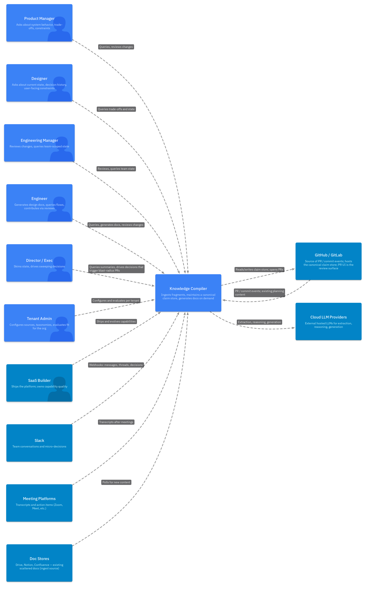

# L1 — System Context

**Knowledge Compiler for Software Engineering Organizations**

A multi-tenant SaaS that builds and maintains a queryable knowledge layer for software engineering teams — capturing the decisions, dependencies, and constraints that today get lost in Slack threads, meeting transcripts, and ad-hoc reviews.

---

## The Problem

Software engineering organizations produce knowledge faster than they can structure it.

- **Slack** captures hundreds of micro-decisions a week. Most never make it into any document.
- **Meetings** generate transcripts and action items, but the broader impact on system architecture stays in people's heads.
- **PR reviews** focus on what's presented — they can't catch the things that didn't make it to the system of record.
- **Design docs** age out the moment they're written. By the time someone consults them, they're partially wrong.

Net effect: the organization's actual state — what was decided, why, what constraints apply, what trade-offs were made — exists as scattered fragments across tools and individual memory. New team members spend weeks reconstructing it. PMs and designers ask engineers questions whose answers should be queryable. Sweeping decisions (platform changes, deprecations) miss large parts of their implications because nobody has a comprehensive view of what depends on what.

The Knowledge Compiler treats these fragments as evidence, extracts the underlying claims, maintains them as a versioned canonical store, and generates the right view of that store on demand — for the right audience, at the right level of detail.

---

## System Context Diagram

---

## What the System Does (and Doesn't)

### In scope

| | |
|---|---|
| **Ingest** | Slack threads, meeting transcripts, PR discussions, existing doc stores |
| **Extract** | Atomic claims with provenance, premise tags, confidence scores |
| **Detect** | Contradictions, supersession, refinement, reinforcement, scope mismatches |
| **Analyze** | Blast radius of sweeping decisions across the dependency graph |
| **Maintain** | Versioned canonical claim store with full audit trail |
| **Generate** | C4 design docs, ADRs, flow walkthroughs, ad-hoc Q&A, comparisons |
| **Review** | Via git PRs with bot-assisted change summaries and conflict annotations |
| **Evaluate** | Built-in eval surfaces for tenants; aggregate telemetry for the builder |
| **Supersede existing doc stores** | The canonical claim store + generated projections replace Confluence / Notion / Drive for the planning-state material this system covers. |

### Out of scope (now)

| | |
|---|---|
| **Code as a source of truth** | Code is the implementation system of record. Planning is the system this addresses. Bridging via ADR mapping is future work. |
| **Real-time collaborative editing** | Edits happen via git PRs, not live multiplayer. |
| **Custom review UI** | GitHub/GitLab PR UI is the review surface. |
| **Authoritative truth resolution** | The system maintains a reviewable view plus a queue of possible conflicts. Humans decide truth. |

### Explicit non-goals

- Not a chat-summarization tool. Summaries lose the structure that makes the SoR queryable.
- Not a wiki replacement. Wikis are human-authored; this is evidence-derived.
- Not a project management tool. Doesn't track tasks, sprints, or assignments.
- Not an oracle. When evidence conflicts, the system surfaces the conflict rather than picking a winner silently.

---

## Personas

What each persona gets, and how they interact.

| Persona | Primary uses | Primary surface |
|---|---|---|
| **Product Manager** | Query system behavior under conditions, trade-offs, constraint history; review changes that affect product surface area | Query UI; PR reviews |
| **Designer** | Understand current trade-offs, query "why this way?", trace decisions that affect user-facing flows | Query UI |
| **Engineering Manager** | Review changes scoped to their team; query cross-cutting state; verify sweeping-decision rework completeness | PR reviews; Query UI |
| **Engineer** | Generate L2/L3 design docs for new work; query end-to-end flows; contribute changes via reviews | Query UI; PR reviews; design doc generation |
| **Director / Exec** | Skim org-wide summaries; drive sweeping decisions; verify that decisions have been fully worked through their implications | Query UI; blast-radius PR oversight |
| **Tenant Admin** | Configure source connectors; define taxonomies (domain / team / lifecycle trees); author and run domain-specific eval golden sets; review failed-query archive | Admin console |
| **SaaS Builder** | Ship and evolve capabilities; maintain benchmark corpus; monitor aggregate telemetry; ship eval-as-a-feature for admins | Builder plane (CI, benchmarks, telemetry dashboards) |

### Persona-to-value summary

- **PM / Designer / Director**: stop asking engineers questions that should be queryable. Get audience-appropriate answers with provenance.
- **EM**: get visibility into changes that affect your team without reading every PR end-to-end.
- **Engineer**: stop hand-writing design docs that recapitulate state. Generate them, then focus the human effort on what's genuinely new.
- **Admin**: own the org's knowledge taxonomy explicitly, rather than implicitly through scattered wiki conventions.
- **Builder**: ship a platform whose quality is measurable and whose failure modes are visible cross-tenant.

---

## Key Architectural Bets

These are the bets that shape the system. Stated upfront so stakeholders understand what's load-bearing.

1. **Atoms (claims) are the canonical System of Record**, not prose documents. Prose is generated on demand.
2. **Git is the review infrastructure.** No custom review UI; PRs and line comments are how humans engage with changes.
3. **Tree-navigation retrieval, not vector RAG.** LLMs reason through hierarchical organization rather than searching by similarity. More accurate, more explainable, more expensive per query.
4. **Premise tags on claims** make sweeping-decision impact analysis tractable. Without them, the system can only catch obvious contradictions.
5. **Multi-tenant SaaS with strict privacy boundaries.** Builder sees aggregate telemetry only — never tenant content.
6. **The system surfaces conflicts; humans resolve them.** Authoritative truth resolution is out of scope. The value is in not letting conflicts go unnoticed.

---

## What Realistic Success Looks Like

Not "the system always knows truth." Rather:

- The org maintains a reviewable, evidence-backed current view of its planning state.
- Sweeping decisions get worked through comprehensively, with the system surfacing what's affected.
- Cross-functional questions get answered without scheduling a meeting.
- New team members ramp by querying instead of pestering.
- A queue of possible conflicts exists and is regularly drained by humans.

Failure modes the system explicitly accepts:

- Imperfect contradiction detection for ambiguous prose.
- Some atoms will be filed in the wrong section initially, requiring admin curation.
- Slack noise (jokes, "lol nvm", off-topic) generates false-positive atoms that the relevance filter and review process must catch.
- Decision-making remains human. The system makes decisions *easier* to make well; it doesn't make them.

---

*Next: see [`L2-containers.md`](./L2-containers.md) for the container-level architecture and [`L3-components.md`](./L3-components.md) for the component-level breakdown.*
