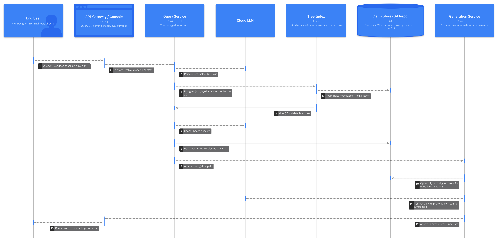
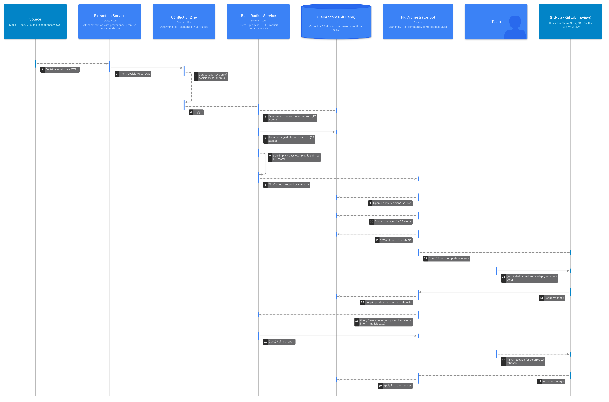
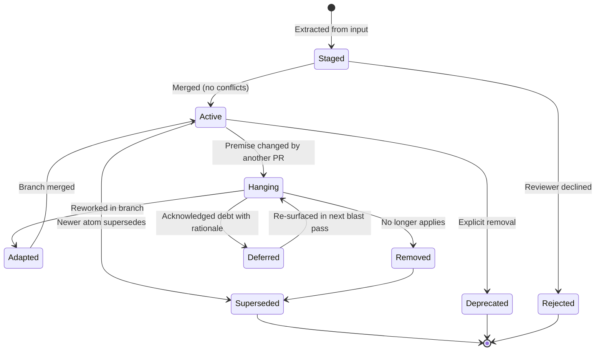
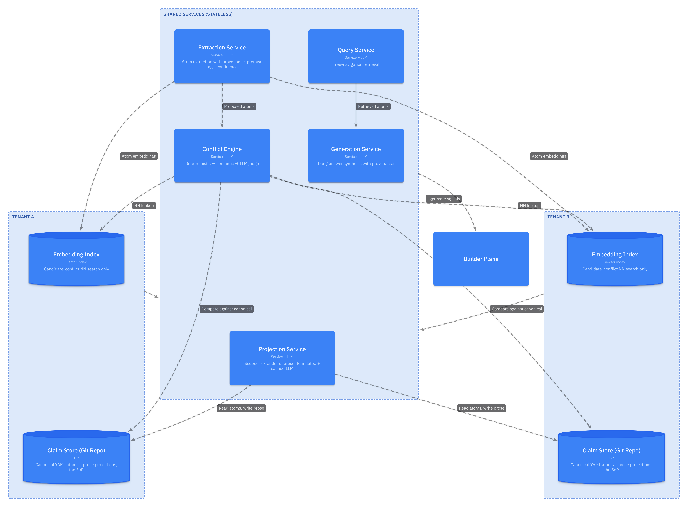

# L2 — Container Diagram

**Knowledge Compiler for Software Engineering Organizations**

A multi-tenant SaaS that turns fragmented organizational inputs (Slack threads, meeting transcripts, PR discussions, decisions) into a canonical, queryable knowledge layer. Treats incoming fragments as evidence, extracts atomic claims as System of Record, generates human-readable views on demand.

---

## Architectural Principles

These decisions shape every container below.

| Principle | Implication |
|---|---|
| Atoms (claims) are canonical SoR | YAML in git repo. Flat with references, never nested. |
| Prose projections are derived | Review surface only. Regenerated from atoms; never authoritative. |
| Git is the review infrastructure | PRs, branches, line comments, merge gates. No custom review UI. |
| Tree-navigation retrieval (PageIndex) | LLM reasons through hierarchy. No vector RAG for read path. |
| Vectors confined to conflict engine | NN search for candidate-conflict surfacing only. |
| Multi-tree organization | Same atoms indexed by domain, team, lifecycle, cross-cutting concern. |
| Premise tags + status field on atoms | Makes blast-radius analysis on sweeping decisions tractable. |
| SaaS responsibility split | Builder ships capability; Admin configures fit; Ingester/User provide signal. |

---

## L2 Overview

Containers grouped into six planes. Each plane is a coherent set of responsibilities.


### Plane summary

| Plane | Containers | Purpose |
|---|---|---|
| **Source** | Source Connectors | External system adapters |
| **Ingest** | Ingestion Service, Raw Store | Normalize and persist raw inputs |
| **Knowledge** | Extraction, Conflict Engine, Blast Radius, Claim Store, Tree Index, Embedding Index | Build and maintain the SoR |
| **Review** | Projection Service, PR Orchestrator Bot | Generate human-reviewable artifacts, drive PR lifecycle |
| **Serve** | API Gateway, Query Service, Generation Service | Answer questions, generate on-demand docs |
| **Quality** | Eval Framework | Benchmarks, golden sets, shadow eval, telemetry |

---

## Write Path — Ingest to Merged PR

What happens when a new Slack thread, meeting transcript, or doc lands.


**Key behaviors:**

- **Staging vs canonical.** Atoms enter staging on a branch; only merged PRs advance the canonical store.
- **Bot does the writing; humans do the approving.** No direct human authorship of atoms — humans edit prose or comment on PRs; the bot reconciles.
- **Completeness gate.** PRs from blast-radius events block merge until all affected atoms have an explicit status (adapted/removed/deferred).

---

## Read Path — Query to Answer

What happens when a user asks "how does flow X work end-to-end?"



**Key behaviors:**

- **No vector retrieval.** Tree navigation is reasoning-based. Each descent step is an LLM call against semantically labeled nodes.
- **Multi-tree.** Same query can enter via different trees (by-domain for "how does X work", by-team for "what does team-X own").
- **Provenance is free.** Navigation path is the trace; every assertion in the answer links to the atoms that backed it.
- **Conflict awareness.** Generator distinguishes "current accepted view" from "conflicting evidence exists, status: under review." Never silently picks one side.

---

## Blast Radius Path — Sweeping Decision

What happens when an exec decision invalidates a large subtree (e.g., "use PWA instead of Android").



**Key behaviors:**

- **Conservative discovery.** Over-flag rather than miss; false positives are cheap to dismiss.
- **Iterative refinement.** As team marks atoms, the LLM-implicit pass uses that as training signal within the PR.
- **Deferred becomes tracked debt.** Atoms marked `Deferred` are first-class state, surfaced periodically.
- **External commitments escalated.** Atoms tagged `external_commitment: true` get different UI treatment — they need approval beyond the dev team.

---

## Container Reference

### Source Connectors

**Purpose**: Adapt heterogeneous external systems into a normalized fragment stream.

**Tech**: Service, per-source adapter modules (one per integration target — chat platform, version-control hosting, doc store, meeting platform, etc.).

**Responsibilities**:
- Authenticate per-tenant credentials (OAuth tokens stored in secrets manager)
- Webhook subscription where possible; polling fallback
- Per-source rate limiting, retry, idempotency
- Normalize to `{ source_uri, timestamp, author, channel/context, content_type, raw_content }`

**Key choices**:
- Adapters are isolated per source; new sources are additive.
- No content interpretation here — pass through.

### Ingestion Service

**Purpose**: Persist raw inputs and apply relevance gating before expensive LLM extraction.

**Tech**: Service.

**Responsibilities**:
- Append every fragment to Raw Store (audit trail; nothing is dropped)
- Apply cheap classifier (small model or rules) to filter likely-relevant content
- Batch by thread / meeting / PR for context-preserving extraction
- Tag with tenant + permission scope

**Key choices**:
- Cost gating is mandatory — un-filtered extraction of all Slack messages is financially infeasible.
- Filter is tunable per-tenant by the admin.

### Raw Store (L0)

**Purpose**: Immutable archive of every incoming fragment.

**Tech**: Blob/object store + relational metadata index.

**Responsibilities**:
- Append-only storage of raw payloads
- Indexed metadata for source, time, channel, author
- Retrievable by URI for provenance verification

**Key choices**:
- Never deleted in normal operation — provenance audit depends on it.
- Tenant-isolated buckets/prefixes.

### Extraction Service

**Purpose**: Convert fragments into atomic claims with provenance, premise tags, confidence.

**Tech**: Service + Cloud LLM.

**Responsibilities**:
- Structured-output LLM call (JSON schema for atoms)
- Assign provenance fields (source URI + quote span)
- Assign premise tags (platform, language, environment, time scope)
- Score confidence based on source type and extraction clarity
- Unit and value normalization (30s/30 seconds/30000ms → canonical form)

**Key choices**:
- Cloud LLM, not local — local models drop noticeably on this task.
- Schema-validated output; rejected if doesn't parse.
- Premise-tag assignment is the highest-leverage discipline for downstream blast-radius accuracy.

### Embedding Index

**Purpose**: NN lookup for candidate-conflict surfacing.

**Tech**: Vector index.

**Responsibilities**:
- Maintain embeddings of all canonical atoms
- KNN over atom subject/predicate/object text for new incoming atoms
- Return candidates for LLM judge stage

**Key choices**:
- Only used in conflict engine — never for retrieval.
- Decoupled from tree navigation; either could be swapped without affecting the other.

### Conflict Engine

**Purpose**: Classify each new atom against the canonical store.

**Tech**: Service + Cloud LLM.

**Responsibilities**:
- Three-stage pipeline: deterministic match → embedding NN → LLM judge
- Output classification: `New`, `Duplicate`, `Reinforces`, `Compatible`, `Refines`, `Supersedes`, `Contradicts`, `Unclear`
- Detect decision-type atoms and trigger Blast Radius
- Persist resolution rationale alongside classification

**Key choices**:
- Deterministic stage handles same-field-different-value cases cheaply with high precision.
- LLM judge only invoked on the shortlist; not every atom pair.

### Blast Radius Service

**Purpose**: For sweeping decisions, compute the set of affected atoms across direct, premise, and implicit dependencies.

**Tech**: Service + Cloud LLM.

**Responsibilities**:
- Traverse explicit dependency graph (direct refs)
- Query by premise tags (e.g., all atoms with `platform: android`)
- LLM-implicit pass over candidate subtree
- Produce categorized report
- Re-evaluate iteratively as team marks atoms during PR

**Key choices**:
- Conservative: over-flag, never miss.
- Transitive: propagate until stable.
- Per-PR learning: signals from team annotations feed back into implicit pass.

### Claim Store (Git Repo)

**Purpose**: The canonical System of Record.

**Tech**: Git repository (GitHub/GitLab/self-hosted).

**Layout**:

```
/raw/                        Mirror / pointers to Raw Store
/claims/
  domains/
    payments/
      services/
        checkout.yaml        Atoms for the Checkout service
        inventory.yaml
      decisions/
        adr-0042.yaml
      glossary.yaml          Domain-specific definition atoms
  cross-cutting/
    security.yaml
    observability.yaml
    glossary.yaml            Org-wide definition atoms
/projections/                Generated prose (per entity)
  payments/services/checkout.md
  glossary.md                Generated alphabetical glossary
/indexes/
  trees/
    by-domain.json           Navigation tree
    by-team.json
    by-lifecycle.json
    by-glossary.json         A→Z navigation over definition atoms
  claim-to-section.json      Reverse index
  premise-index.json         Premise tag → atom IDs
```

**Key choices**:
- YAML for atoms (machine-readable, git-diff-friendly, sorted keys for stability).
- Markdown for projections (human-readable review surface).
- Multiple trees over the same atoms.
- Indexes are generated artifacts but committed (so PRs reveal index changes).
- **Group atoms per-scope, not per-atom.** Every `.yaml` above holds many atoms — checkout.yaml is *all* atoms for the Checkout service, glossary.yaml is *all* glossary terms in scope. One-file-per-atom is explicitly avoided so that filesystem-walk and git operations stay fast as the store grows.

**Glossary as definition atoms**: Glossary entries are not a new atom type — they're atoms of type `definition` (see the canonical data model in [`L3-components.md`](./L3-components.md#canonical-data-model)). Org-wide terms live in `/claims/cross-cutting/glossary.yaml`; terms whose meaning is narrowed by a domain live in `/claims/domains/<domain>/glossary.yaml`. Same atom shape, same review/conflict pipeline — they only differ in which tree axes navigate to them.

### Tree Index

**Purpose**: Maintain multi-axis navigation trees over the claim store.

**Tech**: Service.

**Responsibilities**:
- Build/rebuild trees from the canonical store
- Maintain by-domain, by-team, by-lifecycle, by-glossary, and cross-cutting tag trees
- Provide tree-navigation API for Query Service
- Detect orphans, dead refs, structural rot

**Key choices**:
- Lazy rebuild on PR merge (not real-time during PR review).
- Trees are aligned: same atoms, different paths.

### Projection Service

**Purpose**: Generate prose projections for human review, with scoped re-render and aggressive caching.

**Tech**: Service + Cloud LLM (selective use).

**Responsibilities**:
- Determine affected sections via claim → section reverse index
- Template render structural content (no LLM)
- LLM render narrative paragraphs, cached by `hash(atoms + prompt + model)`
- Anchor LLM with previous prose ("preserve unchanged wording")

**Key choices**:
- Determinism is load-bearing. Without it, git diffs are unreadable.
- Two zones: deterministic (templates) and narrative (cached LLM). Lean structural-heavy until proven otherwise.

### PR Orchestrator Bot

**Purpose**: Drive the entire PR lifecycle on behalf of all upstream services.

**Tech**: Service.

**Responsibilities**:
- Branch creation per ingest batch or per decision
- Commit atom YAML changes
- Trigger projection re-render
- Open PR, post line comments at conflict locations
- Maintain `CHANGES.md`, `BLAST_RADIUS.md`, `CONFLICTS.md`
- Watch PR for manual edits (commits) and re-trigger projection
- Enforce completeness gate before merge
- Update atom statuses on merge

**Key choices**:
- Bot is the only entity that writes to the canonical store.
- Handles human edits to atom YAML during review by re-running downstream steps.

### Query Service

**Purpose**: Resolve user queries via tree-navigation retrieval.

**Tech**: Service + Cloud LLM.

**Responsibilities**:
- Parse query intent
- Select tree axis (by-domain / by-team / by-tag)
- Navigate tree via LLM reasoning
- Collect retrieved atoms and navigation path
- Hand off to Generation Service

**Key choices**:
- No embeddings, no top-k. Reasoning-based descent.
- Navigation path is preserved for provenance.

### Generation Service

**Purpose**: Synthesize answers / docs from retrieved atoms with provenance and conflict awareness.

**Tech**: Service + Cloud LLM.

**Responsibilities**:
- Audience-adapt framing (PM vs Engineer)
- Doc-type selection (Q&A, C4, ADR, walkthrough)
- Synthesize from atoms with explicit provenance citations
- Surface unresolved conflicts ("current view: X, conflicting evidence: Y")
- Propagate confidence into language ("evidence suggests" vs declarative)

**Key choices**:
- Faithfulness check post-generation: atoms in answer must be supported by retrieved set.
- Never silently picks a side in unresolved conflicts.

### Eval Framework

**Purpose**: Build-time benchmarks (Builder) and runtime golden sets (Admin), plus shadow eval and cross-tenant telemetry.

**Tech**: Service.

**Responsibilities**:
- Benchmark corpus management (Builder-owned)
- Tenant golden-set runner (Admin-facing surface)
- LLM-as-judge harness
- Shadow eval on rollouts (capture differences, surface for review)
- Aggregated telemetry across tenants (privacy-respecting)
- Failed-query archive (per-tenant)

**Key choices**:
- Eval-as-a-feature: Admin can author and run their own golden sets via Console.
- Builder sees aggregate signals only, never raw tenant content.

### API Gateway / Console

**Purpose**: Tenant-facing entry point for users, admins.

**Tech**: Web app.

**Responsibilities**:
- Query UI (search box, conversational, embedded)
- Admin console (eval, source config, taxonomy review, permissions)
- Render answers with expandable provenance
- Capture user feedback (thumbs / structured)

---

## Atom Lifecycle State Machine

Every atom has a status that progresses through reviewable states.



**Notes**:
- `Hanging` is the most important state. It says "premise changed; this atom may no longer hold; awaiting human review."
- `Deferred` is tracked technical debt. Periodic reports surface accumulated deferrals.
- Status transitions are themselves auditable — every change carries the PR / commit that caused it.

---

## Cross-Cutting Concerns

### Multi-Tenancy



- **Per-tenant state**: Claim Store, Raw Store, Embedding Index, eval golden sets.
- **Shared, stateless**: Extraction, Conflict, Projection, Query, Generation services. Multi-tenant-aware via request context.
- **Builder plane**: aggregate telemetry only, no raw tenant content.

### Privacy Boundaries

| What | Where | Builder visibility |
|---|---|---|
| Raw content (Slack, transcripts, etc.) | Tenant Raw Store | None |
| Atoms (canonical) | Tenant Claim Store | None |
| Prose projections | Tenant Claim Store | None |
| LLM call traces with content | Per-request, ephemeral | Sampled with consent only |
| Aggregate metrics (latency, classification distribution, error rates) | Builder Plane | Full |
| Failed-query archive | Per-tenant | None |

### LLM Call Layer

| Use case | Layer | Default | Override |
|---|---|---|---|
| Atom extraction | Cloud | Top-tier hosted LLM | Local for privacy-sensitive tenants |
| Conflict judge | Cloud | Top-tier | Could downgrade to mid-tier for cost |
| Blast radius implicit pass | Cloud | Top-tier | — |
| Narrative projection rendering | Cloud (cached) | Mid-tier | — |
| Pre-extraction relevance filter | Local / cheap classifier | Small open model | Cloud cheap-tier |
| Query reasoning / tree descent | Cloud | Top-tier | — |
| Generation synthesis | Cloud | Top-tier | — |

LLM calls flow through a single abstraction layer that allows per-tenant or per-use-case routing. Enterprise tenants can mandate local-only extraction without forking the service.

---

## What's NOT in L2

For clarity, things deliberately not present at this level:

- **Code as a source of truth.** Parked. Will bridge via ADRs in a later iteration.
- **A custom review UI.** Git's PR UI is the review surface.
- **A general-purpose vector DB.** Embeddings are confined to conflict candidate retrieval.
- **A separate workflow engine.** PR Orchestrator Bot is the workflow.

---

*Next: see `L3-components.md` for the component-level breakdown of each significant container.*
