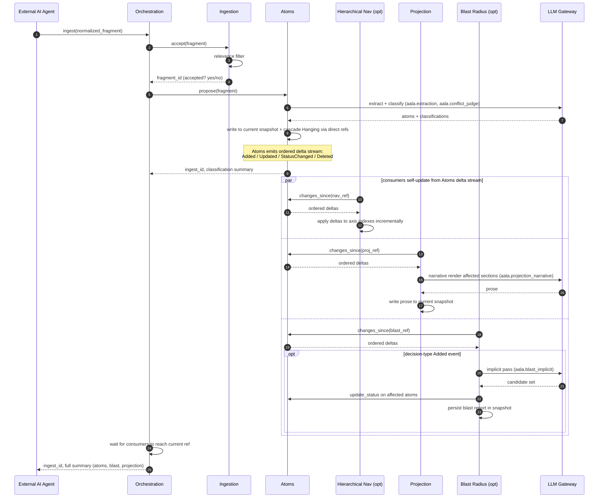
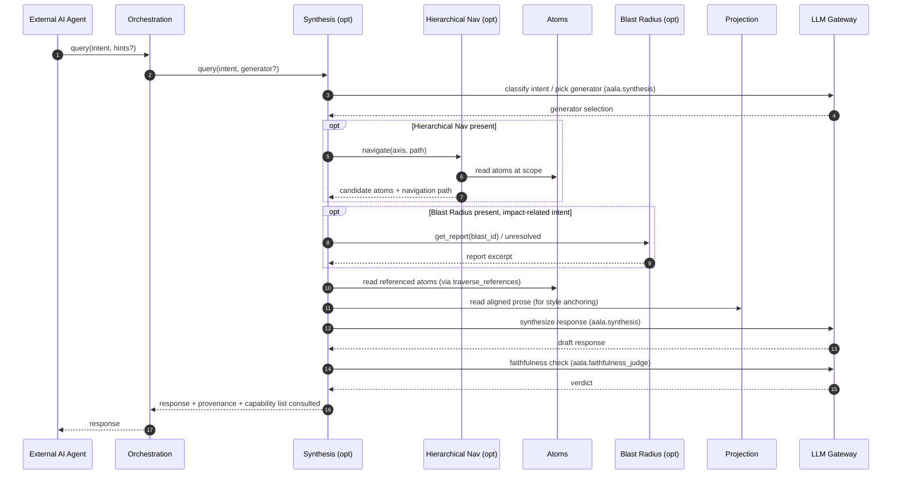
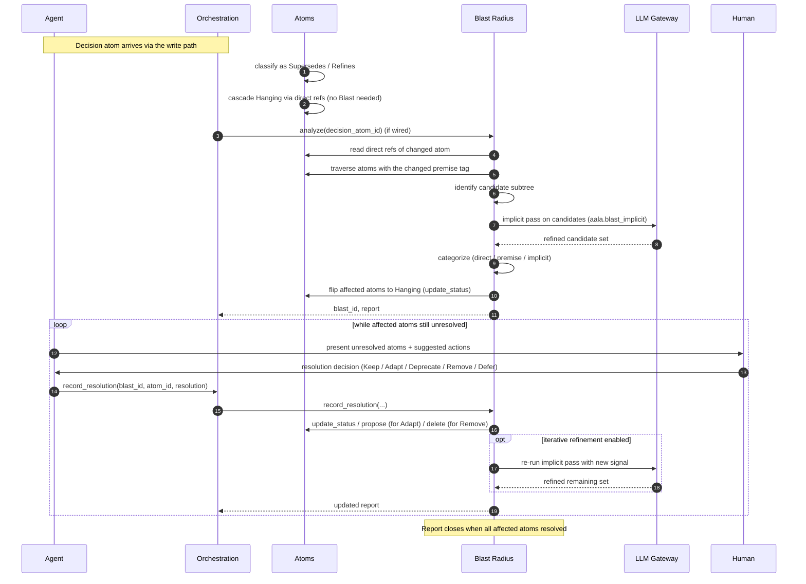
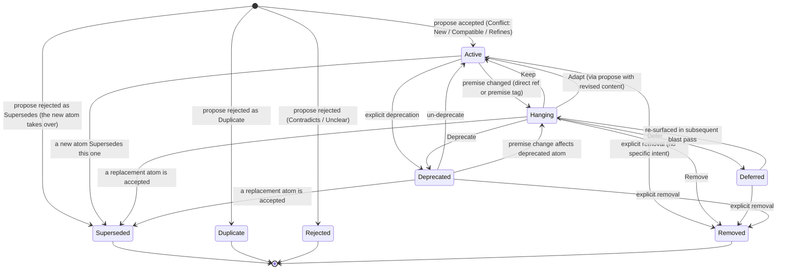

# Flows and Lifecycle

This chapter captures the behavior of the system over time: the three end-to-end paths a request travels through aala, and the state machine an atom moves through.

The flows assume the full container set is wired. Each capability-container called out as *(opt)* may be absent in a given implementation; when it is, the orchestration step that calls it is skipped or degrades to a simpler fallback (see the respective container chapters).

## Write path — ingest to canonical snapshot

A normalized fragment arrives via [Orchestration](./05-orchestration.md). Ingestion persists it; [Atoms](./03-atoms.md) extracts, classifies, and applies changes to the snapshot — emitting an ordered delta stream as it goes. Downstream consumers ([Hierarchical Navigation](./06-hierarchical-nav.md), [Projection](./04-projection.md), [Blast Radius](./07-blast-radius.md)) read that stream and update their derived state in parallel. Orchestration waits for consumers to catch up before returning. The human reviews the snapshot diff and publishes it as canonical via whatever lifecycle the deployment supports.

**Key behaviors:**

- **Atoms applies changes to the current snapshot atomically.** Extraction, conflict classification, and direct-reference Hanging cascade all land in one snapshot transition.
- **Atoms emits an ordered delta stream.** Downstream consumers (Hierarchical Nav, Projection, Blast Radius) self-subscribe and apply deltas incrementally — Orchestration does not push-notify each one. See [`01-principles.md`](./01-principles.md) for the principle.
- **Consumers run in parallel.** Each tracks its own checkpoint `ref`; none depends on the others.
- **Orchestration waits for catch-up** before returning to the agent, so the agent's response reflects a consistent post-ingest view.
- **Publishing the snapshot as canonical** happens outside this flow. In deployments where the user owns git, it's a `git commit`. In other deployments, it's an explicit `Orchestration.publish_as_canonical` call.

## Read path — query to synthesized answer

A query intent arrives via Orchestration; [Synthesis](./08-synthesis.md) (if wired) picks a generator and composes available capabilities into a response with provenance.

**Key behaviors:**

- **Without Synthesis**, Orchestration falls back to direct Atoms reads (`get_by_id`, `traverse_references`, `list_scope`). The agent does its own composing.
- **Without Hierarchical Nav**, Synthesis uses brute-force atom traversal — slower, lower-precision retrieval, but functional.
- **Provenance is always returned** alongside the response: atoms cited, navigation path used, which capabilities were consulted.
- **Faithfulness is a configurable gate** inside Synthesis; modes range from off (no check) to block (fail the request on confabulation).

## Blast radius path — sweeping decision

When a decision atom invalidates a premise that other atoms depended on, the impact analysis loop runs to identify the affected set and tracks resolution as humans work through it.

**Key behaviors:**

- **Direct-reference Hanging cascading is owned by Atoms**, runs whether or not Blast Radius is wired.
- **Blast Radius extends the affected set** via premise-tag lookup and the LLM-implicit pass.
- **Iterative refinement** uses each human resolution as signal — the implicit pass may revise its remaining suggestions as the team works through the report.
- **Removal carries intent.** `Superseded` / `Duplicate` / `Rejected` / `Removed` are distinct outcomes with meta (`superseded_by`, `duplicate_of`, rationale). Implementations may apply them as actual deletion (relying on snapshot history + Change Log for audit) or as tombstone statuses on the atom — both are conformant.

## Atom lifecycle state machine

**Present states** the atom can be in: `Active`, `Hanging`, `Deferred`, `Deprecated`. **Removal outcomes** that take the atom out of the snapshot, each carrying intent: `Superseded`, `Duplicate`, `Rejected`, `Removed`. Two orthogonal axes for present states: the *premise question* axis (`Active ⇄ Hanging`, with `Deferred` as the acknowledged-but-parked branch) and the *winding-down* axis (`Active ⇄ Deprecated`).

**Present-state meanings:**

- `Active` — currently held to be true. The default. Included in active reads, projections, navigation, conflict comparisons.
- `Hanging` — a related premise / decision changed; this atom may no longer hold; awaiting human resolution. Included in reads with a hanging marker; flagged in conflict comparisons.
- `Deferred` — known to be hanging; team chose to defer action. Acknowledged debt. Re-surfaces in subsequent blast passes that touch the same premise.
- `Deprecated` — still holds for existing dependents, but new dependencies should not be added against it. Conflict (inside Atoms) flags any new atom proposed against a Deprecated parent for review.

**Removal-outcome meanings** (atom removed from snapshot; intent recorded in Change Log meta):

- `Superseded` — a different atom now holds. Meta: `superseded_by` atom id.
- `Duplicate` — was a duplicate of a canonical atom. Meta: `duplicate_of` atom id.
- `Rejected` — proposal rejected; never made it to canonical (e.g., Contradicts that couldn't be reconciled). Meta: rationale.
- `Removed` — generic removal; no further intent. Meta: rationale.

**Implementation choice:** removal outcomes may persist as tombstone statuses on the atom (so the atom remains in the store with its outcome label) or be applied as actual deletion with the outcome recorded only in the Change Log. Either is conformant; the conceptual model treats the outcome as intent regardless of persistence.

**Transition triggers (where each is invoked):**

| Transition | Triggered by |
|---|---|
| `[*] → Active` | `Atoms.propose` accepting a `New` / `Compatible` / `Refines` classification. |
| `[*] → Superseded` (immediate) | A proposed atom is rejected because it Supersedes an existing one — the existing atom records `Superseded` with `superseded_by` set to the new accepted atom. |
| `[*] → Duplicate` / `Rejected` | Conflict pipeline classification outcomes during `propose`. |
| `Active → Hanging` | Atoms's direct-reference cascade, or [Blast Radius](./07-blast-radius.md) extending via premise tags / implicit reasoning. |
| `Active → Deprecated` | `Atoms.update_status(... Deprecated)`. |
| `Active → Superseded` | A subsequently accepted atom Supersedes this one (driven by Conflict pipeline during a later `propose`). |
| `Active → Removed` | `Atoms.update_status(... Removed)` — explicit non-specific removal. |
| `Hanging → Active` (Keep) | `Atoms.update_status(... Active)`. |
| `Hanging → Active` (Adapt) | `Atoms.propose(...)` with revised content. |
| `Hanging → Deferred` | `Atoms.update_status(... Deferred)`. |
| `Hanging → Removed` | `Atoms.update_status(... Removed)`. |
| `Hanging → Deprecated` | `Atoms.update_status(... Deprecated)`. |
| `Hanging → Superseded` | A replacement atom is accepted via `Atoms.propose`. |
| `Deferred → Hanging` | Blast Radius re-evaluation that re-surfaces the atom. |
| `Deprecated → Active` | `Atoms.update_status(... Active)`. |
| `Deprecated → Hanging` | Reference cascade. |
