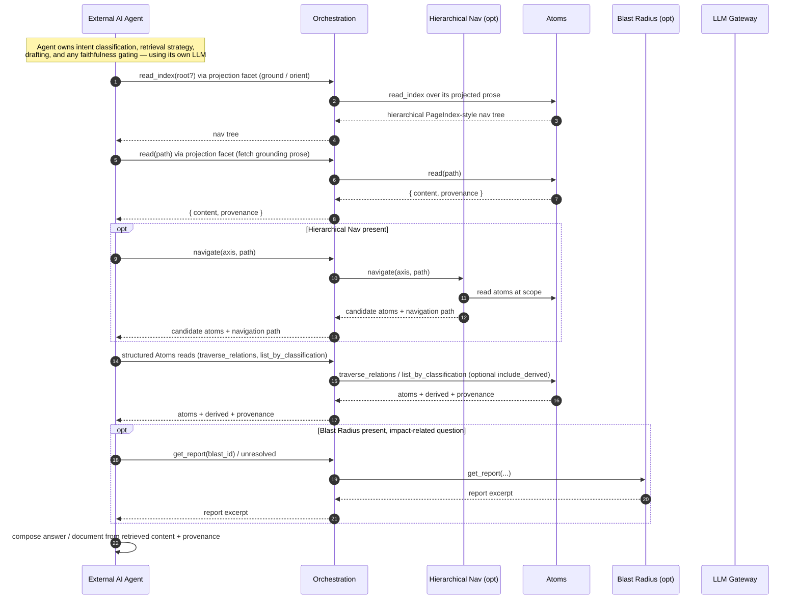
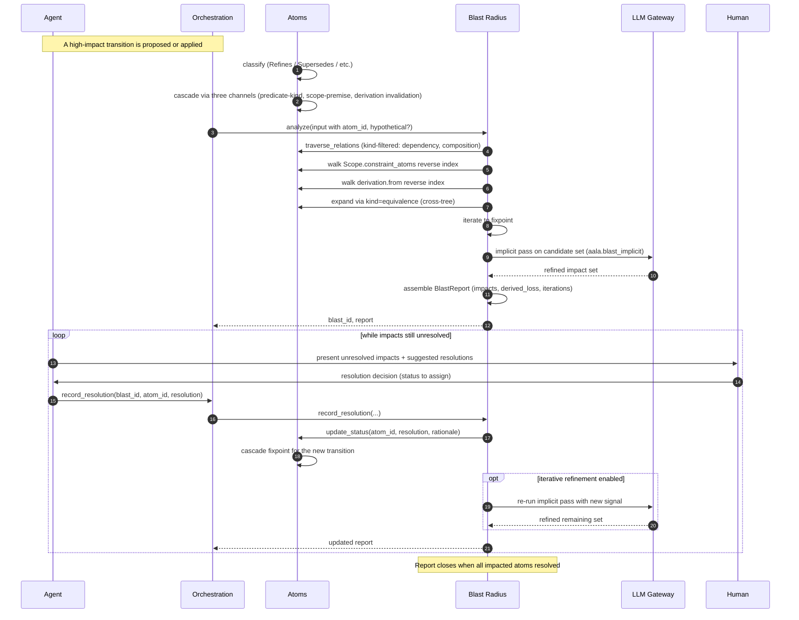

# Flows and Lifecycle

This chapter captures the behavior of the system over time: the three end-to-end paths a request travels through aala, and the state machine an atom moves through.

The flows assume the full container set is wired. Each capability-container called out as *(opt)* may be absent in a given implementation; when it is, the orchestration step that calls it is skipped or degrades to a simpler fallback (see the respective container chapters).

## Write path — ingest to canonical snapshot

A normalized fragment arrives via [Orchestration](./05-orchestration.md). Ingestion persists it; [Atoms](./03-atoms.md) extracts, classifies, applies the conflict pipeline, mutates the snapshot, and runs the three-channel cascade fixpoint — emitting an ordered delta stream as it goes. Downstream consumers ([Hierarchical Navigation](./06-hierarchical-nav.md), [Blast Radius](./07-blast-radius.md)) read that stream and update their derived state in parallel, while Atoms re-derives its own [projection facet](./04-projection.md) (canonical claim prose + glossary) for affected sections. Orchestration waits for consumers to catch up before returning. The human reviews the snapshot diff and publishes it as canonical via whatever lifecycle the deployment supports.

```mermaid
sequenceDiagram
    autonumber
    participant Agent as External AI Agent
    participant Orch as Orchestration
    participant Ing as Ingestion
    participant Atoms as Atoms
    participant Nav as Hierarchical Nav (opt)
    participant Blast as Blast Radius (opt)
    participant LLM as LLM Gateway

    Agent->>Orch: ingest(fragment, options?)
    Orch->>Ing: accept(fragment)
    Ing->>Ing: relevance filter
    Ing-->>Orch: fragment_id (accepted? yes/no)
    Orch->>Atoms: propose(fragment, hints with tree)
    Atoms->>LLM: extract (aala.extraction), classify (aala.classification_suggest, aala.predicate_suggest)
    LLM-->>Atoms: atoms + classifications + predicate refs
    Atoms->>LLM: judge ambiguous conflicts (aala.conflict_judge)
    LLM-->>Atoms: outcomes + resolution mode
    Atoms->>Atoms: structural validation → alias resolution → schema validation → duplicate/similarity → edge-specific checks → equivalence coherence → capacity/promotion → cross-tree advisory
    Atoms->>Atoms: write to snapshot + run cascade fixpoint (predicate-kind, scope-premise, derivation invalidation)
    Atoms->>Atoms: compute T1 + T2 derivations (T3 produces conflict outcomes)
    Note over Atoms: Atoms emits ordered delta stream:<br/>Added / DerivedAdded / Updated / StatusChanged /<br/>Superseded / Duplicate / Rejected / Removed /<br/>DerivedInvalidated / ConflictOutcomeEmitted / etc.
    Atoms->>LLM: narrative render affected sections via projection facet (aala.projection_narrative)
    LLM-->>Atoms: prose
    Atoms->>Atoms: write projected claim prose to snapshot; update glossary
    Atoms-->>Orch: ingest_id, ProposeResult (added, derived_added, outcomes, cascaded)

    par consumers self-update from Atoms delta stream
        Nav->>Atoms: changes_since(nav_ref)
        Atoms-->>Nav: ordered deltas
        Nav->>Nav: apply deltas to axis indexes incrementally
    and
        Blast->>Atoms: changes_since(blast_ref)
        Atoms-->>Blast: ordered deltas
        opt high-impact transition detected
            Blast->>Blast: analyze(atom_id)
            Blast->>LLM: implicit pass (aala.blast_implicit)
            LLM-->>Blast: refined impact set
            Blast->>Blast: persist report
        end
    end

    Orch->>Orch: wait for consumers to reach current ref
    Orch-->>Agent: ingest_id, full summary (atoms, blast, projected sections)
```

**Key behaviors:**

- **Atoms applies changes to the current snapshot atomically.** Extraction, conflict classification, status manager mutations, and the three-channel cascade fixpoint all land in one snapshot transition.
- **Conflict outcomes are first-class results, not errors.** The `ProposeResult` enumerates them with their `mode` (auto-resolve / soft-prompt / hard-block) and `resolution_paths`. Hard-block outcomes prevent the atom from being added; soft-prompt outcomes leave the atom in the snapshot awaiting review.
- **Atoms emits an ordered delta stream.** Downstream consumers self-subscribe and apply deltas incrementally. Causality ordering ensures `Added(A)` precedes any event referencing `A`; `DerivedAdded(D)` follows `Added(S)` for every `S` in `D.derivation.from`.
- **Consumers run in parallel.** Each tracks its own checkpoint `ref`; none depends on the others.
- **Orchestration waits for catch-up** before returning to the agent, so the agent's response reflects a consistent post-ingest view.
- **Publishing the snapshot as canonical** happens outside this flow. In deployments where the user owns git, it's a `git commit`. In other deployments, it's an explicit `Orchestration.publish_as_canonical` call.

## Read path — external agent composes over aala's read surfaces

Answering questions and generating documents are **not** aala concerns. An external agent reads aala's surfaces through Orchestration and composes the answer itself: it navigates the [projection facet](./04-projection.md) index and fetches prose to ground its understanding, then issues structured [Atoms](./03-atoms.md) reads for precision and provenance. See [`analysis/agent-integration-pattern.md`](../../analysis/agent-integration-pattern.md) for the recommended pattern.



**Key behaviors:**

- **The agent composes, not aala.** Orchestration routes reads (projection-facet `read_index` / `read` / `list` and structured Atoms reads); the agent does its own retrieval strategy, drafting, and faithfulness gating using its own LLM.
- **Projection grounds; Atoms gives precision.** The agent navigates the projection-facet index and reads prose to orient, then issues structured Atoms reads (`get_by_id`, `traverse_relations`, `list_by_classification`, `list_scope`) for exact claims and provenance.
- **Without Hierarchical Nav**, the agent falls back to brute-force atom traversal — slower, lower-precision retrieval, but functional.
- **Provenance travels with every read.** Projection `read` returns `{ content, provenance }`; structured Atoms reads return the cited atoms and any surfaced derived atoms — the agent attributes its answer from these.

## Blast radius path — sweeping transition

When a transition has broad downstream impact, the analysis loop runs to identify the impact set and tracks resolution as humans work through it.



**Key behaviors:**

- **Atoms's three-channel cascade runs whether or not Blast Radius is wired** — Blast Radius surfaces the cascade as a queryable read-only report; it doesn't cause the cascade.
- **Blast Radius extends the impact set** via the optional LLM-implicit pass for non-structural impacts.
- **Iterative refinement** uses each reviewer resolution as signal — the implicit pass may revise its remaining suggestions as the team works through the report.
- **Removal carries intent.** Removal outcomes (`superseded`, `duplicate`, `rejected`, `removed`) are distinct with meta (`superseded_by`, `duplicate_of`, rationale). They are committed as tombstone transitions (the atom is retained with the removal-outcome status); physical deletion happens only via an optional, later garbage-collection pass.

## Atom lifecycle state machine

**Present states** the atom can be in: `active`, `hanging`, `deferred`, `deprecated`. **Removal outcomes** that take the atom out of the snapshot, each carrying intent: `superseded`, `duplicate`, `rejected`, `removed`.

```mermaid
stateDiagram-v2
    [*] --> active: propose accepted (Duplicate auto-resolve = false; New / Refines / soft Supersedes)
    [*] --> superseded: propose accepted as Supersedes (this atom takes over for the prior atom)
    [*] --> duplicate: propose classified as Duplicate (hard-block; this atom rejected)
    [*] --> rejected: hard-block conflict outcome (Composition / DisjointEquivalence / etc.)

    active --> hanging: cascade (predicate-kind / scope-premise / derivation)
    active --> deprecated: explicit deprecation via update_status
    active --> superseded: a new atom Supersedes this one
    active --> removed: explicit removal via update_status

    hanging --> active: reviewer Keep
    hanging --> active: reviewer Adapt (revised content via propose)
    hanging --> deferred: reviewer Defer
    hanging --> removed: reviewer Remove
    hanging --> deprecated: reviewer Deprecate
    hanging --> superseded: a replacement atom is accepted

    deferred --> hanging: re-surfaced in subsequent cascade
    deferred --> active: reviewer Keep
    deferred --> removed: reviewer Remove

    deprecated --> hanging: cascade reaches it
    deprecated --> removed: explicit removal
    deprecated --> superseded: a replacement atom is accepted

    superseded --> [*]
    duplicate --> [*]
    rejected --> [*]
    removed --> [*]
```



**Present-state meanings:**

- `active` — currently held to be true. The default. Included in active reads, projections, navigation, conflict comparisons.
- `hanging` — a related premise / source changed; this atom may no longer hold; awaiting reviewer resolution. Included in reads with a hanging marker; flagged in conflict comparisons.
- `deferred` — known to be hanging; team chose to defer action. Acknowledged debt. Re-surfaces in subsequent cascade passes that touch the same premise.
- `deprecated` — still holds for existing dependents, but new dependencies should not be added against it. Conflict pipeline flags any new atom proposed against a deprecated parent for review.

**Removal-outcome meanings** (committed atom tombstoned, or never-committed proposal dropped; intent recorded in the change stream):

- `superseded` — a different atom now holds. Meta: `superseded_by` atom id.
- `duplicate` — was a duplicate of a canonical atom. Meta: `duplicate_of` atom id.
- `rejected` — proposal rejected; never made it to canonical (e.g., hard-block conflict outcome). Meta: rationale.
- `removed` — generic removal; no further intent. Meta: rationale.

Applying a removal outcome is a two-step process: the atom MUST first transition to the removal-outcome status and be committed as a **tombstone** (it remains with that status, carrying its `correlation_id`, rationale, and meta); it is never deleted directly. Physical deletion happens only via an optional, `system:`-correlated garbage-collection pass that emits `Purged` — giving every atom a clean, auditable lifecycle. See [07 — Atom Lifecycle](../../spec/07-atom-lifecycle.md) § Garbage collection.

**Transition triggers (where each is invoked):**

| Transition | Triggered by |
|---|---|
| `[*] → active` | `Atoms.propose` accepting a New / Refines / soft Supersedes classification. |
| `[*] → superseded` (immediate) | A proposed atom replaces an existing one — the existing atom records `superseded` with `superseded_by` set to the new accepted atom. |
| `[*] → duplicate` / `rejected` | Conflict pipeline classification during `propose` (Duplicate auto-resolve at high confidence; hard-block outcomes for structural violations). |
| `active → hanging` | Cascade across any channel: predicate-kind (dependency target hangs/removes; composition source removes above threshold), scope-premise (`Scope.constraint_atoms` entry transitions), or derivation invalidation. |
| `active → deprecated` | `Atoms.update_status(... deprecated)`. |
| `active → superseded` | A subsequently accepted atom Supersedes this one. |
| `active → removed` | `Atoms.update_status(... removed)`. |
| `hanging → active` (Keep) | `Atoms.update_status(... active)`. |
| `hanging → active` (Adapt) | `Atoms.propose(...)` with revised content. |
| `hanging → deferred` | `Atoms.update_status(... deferred)`. |
| `hanging → removed` | `Atoms.update_status(... removed)`. |
| `hanging → deprecated` | `Atoms.update_status(... deprecated)`. |
| `hanging → superseded` | A replacement atom is accepted via `Atoms.propose`. |
| `deferred → hanging` | Subsequent cascade re-surfaces the atom. |
| `deferred → active` | `Atoms.update_status(... active)`. |
| `deprecated → hanging` | Cascade reaches it. |
