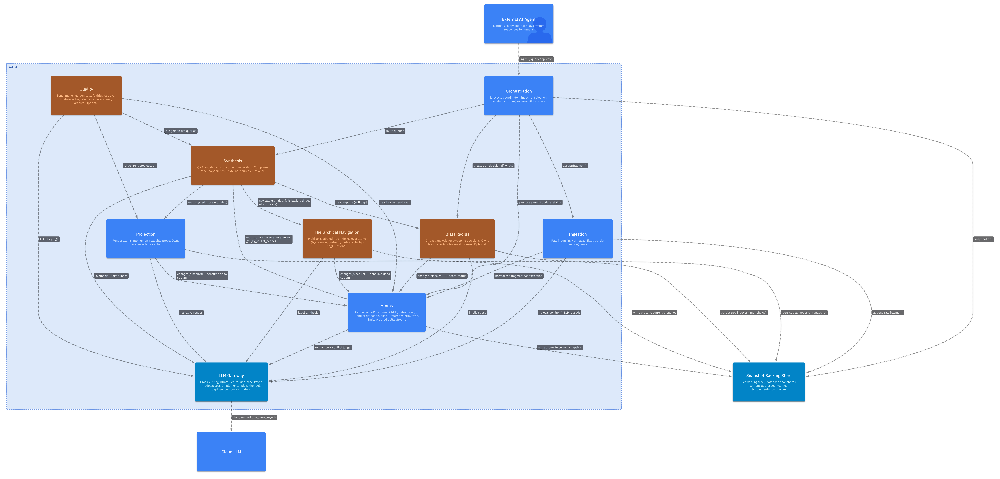

# L2 — Container Architecture

**Knowledge Compiler — conceptual container architecture.**

This folder documents the *superset* of containers a full aala deployment may include. Specific deployable shapes (local-MCP+agent, SaaS multi-tenant, real-time meeting capture, etc.) realize subsets of these containers — see `docs/implementations/<impl>/` for those.

The container list below is a consequence of applying the principles in [`01-principles.md`](./01-principles.md), not an arbitrary partition. Read that first if you're new to this design.

## Container list

| # | Container | Optional? | Concern |
|---|---|---|---|
| 1 | [Ingestion](./02-ingestion.md) | non-optional | Bring raw inputs into the system; normalize; persist. |
| 2 | [Atoms](./03-atoms.md) | non-optional | Canonical record of claims. Owns the typed grammar (entity/relation/classification/predicate/predicate_kind), schema model, extraction, conflict classification, status transitions, cascade machinery, relation traversal, entailment. Implements the [Projection](./04-projection.md) facet over its claims (required). |
| 3 | [Orchestration](./05-orchestration.md) | non-optional | Coordinate the pipeline lifecycle. Owns snapshot lifecycle and tree registry. The entry point that external clients (agents, CI, webhooks) talk to. |
| 4 | [LLM Gateway](./09-llm-gateway.md) | cross-cutting infrastructure (non-optional) | One abstraction for chat + embeddings + structured output, with per-use-case routing. Consumed by Atoms (extraction, conflict, classification & predicate suggestions, projection narrative) and Quality (LLM-as-judge). |
| 5 | [Hierarchical Navigation](./06-hierarchical-nav.md) | optional | Multi-axis tree indexes over atoms (by-classification, by-team, by-lifecycle, by-tag, by-tree) with synthesized labels for LLM-driven descent. |
| 6 | [Blast Radius](./07-blast-radius.md) | optional | Impact analysis for transitions. Read-only pipeline that consumes the three cascade channels (predicate-kind, scope-premise, derivation-invalidation) and produces a blast report with reviewer resolution tracking. |
| 7 | [Quality](./10-quality.md) | optional, cross-cutting measurement | Benchmark + golden-set runners, faithfulness eval, LLM-as-judge harness, planted-contradiction tests, telemetry. |

## Cross-cutting facet

| Facet | Concern |
|---|---|
| [Projection](./04-projection.md) | Read-only prose rendering + navigable index of a container's own state. **Not a container** — a shared interface each contentful container implements over its own content (`list`/`read`/`read_index`/`changes_since`). Required of Atoms; optional for Ingestion, Blast Radius, Hierarchical Navigation. |

Each container exposes its own read API (state + diff) and, where applicable, its own write API. There is no shared storage container, and no shared rendering container — every container owns its corner of state and renders its own content through the Projection facet.

**Generation and Q&A are not aala concerns.** aala provides a grounded, readable, navigable substrate; external agents compose answers and documents (ADRs, pitches, diagrams, walkthroughs) on top of aala's read surfaces. See [`analysis/agent-integration-pattern.md`](../../analysis/agent-integration-pattern.md).

## Other chapters

- [`01-principles.md`](./01-principles.md) — Data + architecture principles.
- [`11-flows.md`](./11-flows.md) — Write path, read path, blast radius path; atom-lifecycle state machine.
- [`12-cross-cutting.md`](./12-cross-cutting.md) — Multi-tenancy, privacy boundaries, LLM call layer.
- [`13-scope-boundaries.md`](./13-scope-boundaries.md) — What's NOT in L2.

## Diagram

The L2 container diagram is generated from `docs/likec4/L2/L2.c4`. To regenerate after changing the source: `cd docs/likec4 && npm run export:L2`.

