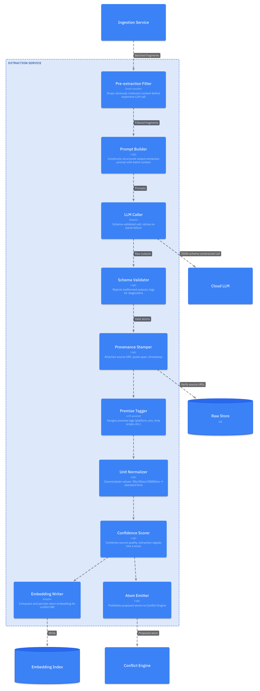
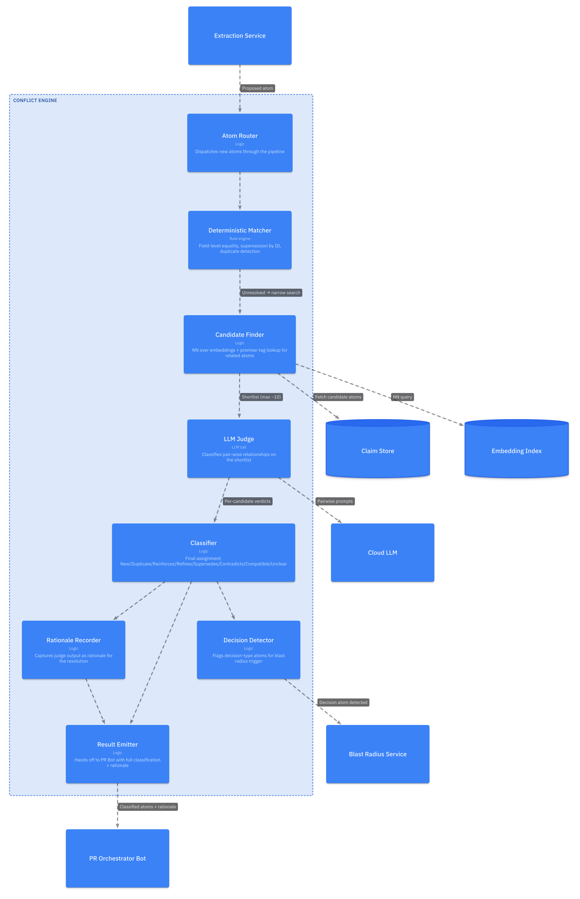
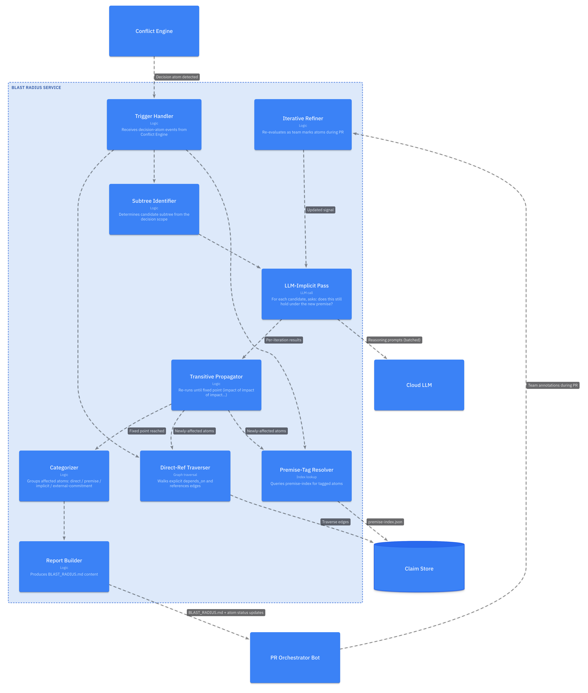
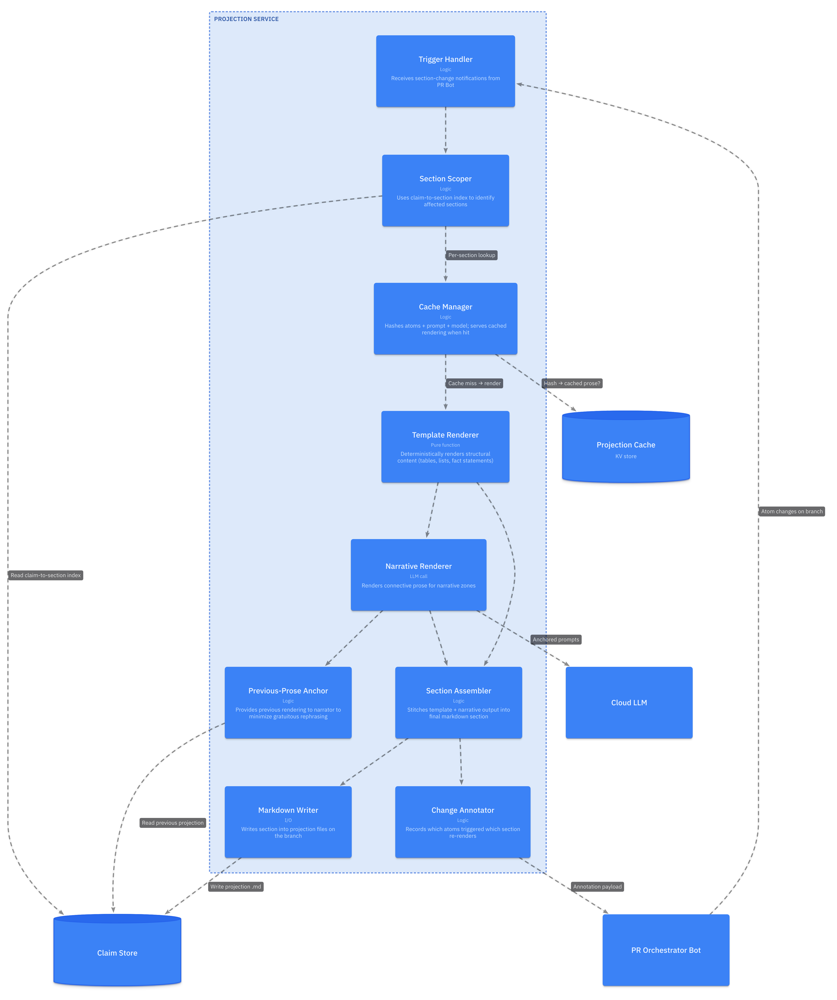
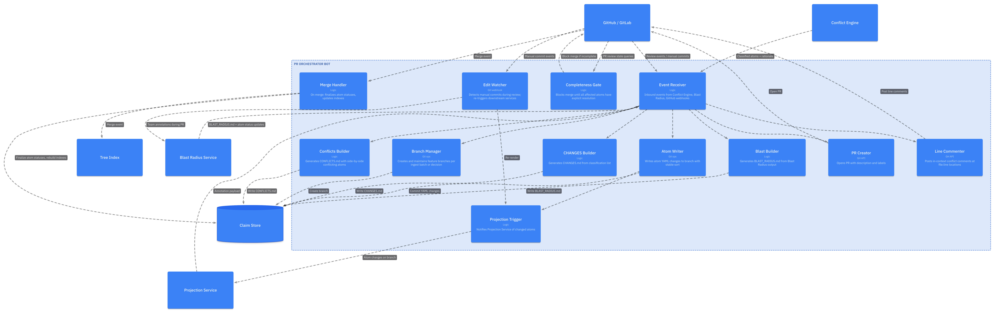
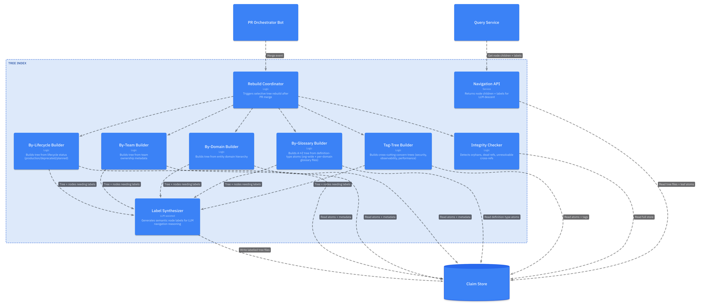
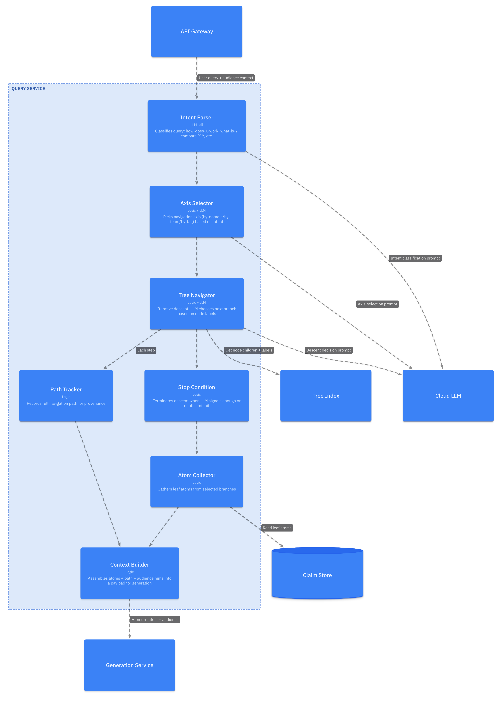
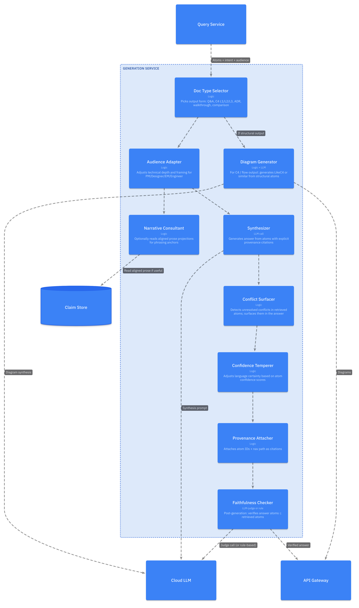
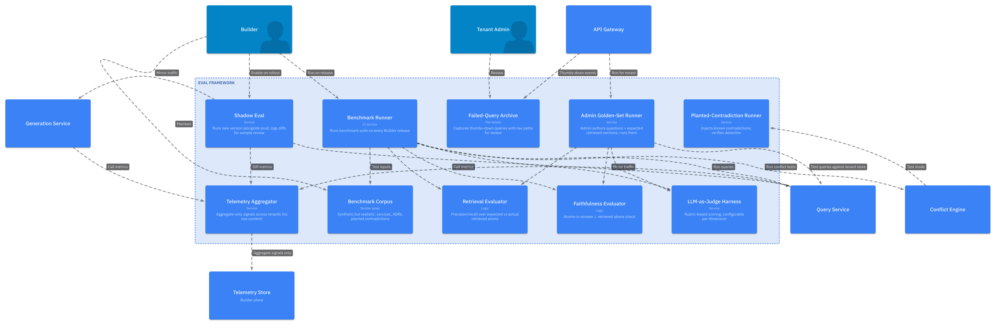
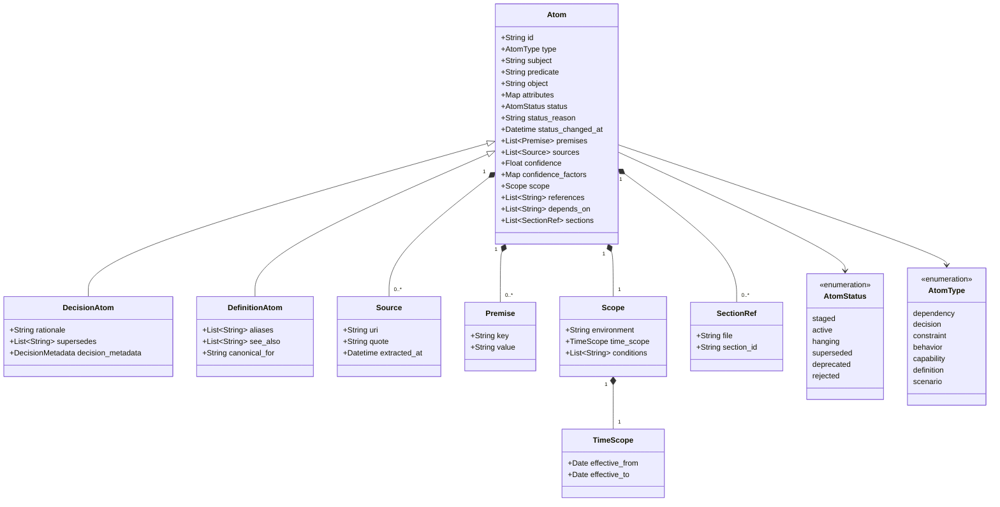

# L3 — Component Diagrams

**Knowledge Compiler — Component-Level Breakdown**

This document drills into the significant containers from `L2-containers.md`. Each section gives:

1. A component diagram for the container.
2. A table describing each component.
3. Key internal flows where useful.

Containers covered:

- [Extraction Service](#extraction-service)
- [Conflict Engine](#conflict-engine)
- [Blast Radius Service](#blast-radius-service)
- [Projection Service](#projection-service)
- [PR Orchestrator Bot](#pr-orchestrator-bot)
- [Tree Index](#tree-index)
- [Query Service](#query-service)
- [Generation Service](#generation-service)
- [Eval Framework](#eval-framework)

Plus the [Canonical Data Model](#canonical-data-model) at the end.

---

## Extraction Service

Converts incoming fragments into structured atomic claims.



| Component | Responsibility | Notes |
|---|---|---|
| Pre-extraction Filter | Drop irrelevant fragments cheaply | Small open model or rules. Tunable per-tenant. |
| Prompt Builder | Construct extraction prompts | Includes batch context (thread/meeting). |
| LLM Caller | Make schema-validated calls | Structured outputs / JSON mode. |
| Schema Validator | Reject malformed outputs | Logs to debug bucket. Auto-retry once with corrective prompt. |
| Provenance Stamper | Attach `source_uri`, `quote_span` | Cross-check against Raw Store entry. |
| Premise Tagger | Assign `platform`, `env`, `time_scope`, etc. | Highest-leverage discipline for blast-radius accuracy. LLM-assisted with a tag dictionary maintained per tenant. |
| Unit Normalizer | Canonicalize values | Lightweight, deterministic. Critical for true-positive contradiction detection. |
| Confidence Scorer | Score atom confidence | Sources: type (Slack joke vs ADR), extraction signals (model hesitation), corroboration. |
| Embedding Writer | Persist atom embedding | Used only by Conflict Engine. |
| Atom Emitter | Publish to Conflict Engine | Async; per-atom or per-batch. |

**Important behaviors:**

- Pre-filter is cheap but biased toward false positives (keeps marginal fragments). It is *not* the place to be aggressive.
- The Premise Tagger is the component most prone to silent quality loss. If it stops tagging accurately, blast-radius analysis degrades invisibly. Eval coverage here is critical.

---

## Conflict Engine

Classifies each new atom against the canonical store via a three-stage pipeline.



| Component | Responsibility | Notes |
|---|---|---|
| Atom Router | Dispatch through pipeline | Bypass to LLM judge for atoms with explicit `supersedes` field. |
| Deterministic Matcher | Find clear matches/conflicts cheaply | Field-level equality after unit normalization. Catches the easy 60–70% of cases. |
| Candidate Finder | Surface plausible related atoms | Combines embedding NN with premise-tag overlap. Targets recall over precision. |
| LLM Judge | Pairwise classification on shortlist | The expensive step. Capped at ~10 candidates per new atom. |
| Classifier | Assign final class | Combines deterministic and judge outputs; tie-breaks toward Unclear when judge disagrees. |
| Decision Detector | Flag decision atoms | Triggers Blast Radius for atoms in the `decisions/` subtree or with `decision: true` tag. |
| Rationale Recorder | Persist judge reasoning | Becomes part of the commit metadata; reviewer-visible. |
| Result Emitter | Hand off to PR Bot | Per-atom message including classification, candidates, rationale. |

**Three-stage rationale:**

| Stage | Cost | Precision | Recall | Purpose |
|---|---|---|---|---|
| Deterministic | Negligible | Very high | Low | Catch the obvious |
| Embedding NN + premise lookup | Low | Medium | High | Surface candidates |
| LLM Judge | High | High | High | Adjudicate the shortlist |

Skipping stage 1 or 2 makes stage 3 unaffordable at any scale.

---

## Blast Radius Service

Computes the set of atoms affected by a sweeping decision.



| Component | Responsibility | Notes |
|---|---|---|
| Trigger Handler | Entry point | Receives `{ decision_atom, superseded_atom }` from Conflict Engine. |
| Direct-Ref Traverser | Walk explicit refs | Cheapest, most reliable detection. |
| Premise-Tag Resolver | Find tagged atoms | Uses pre-built `premise-index.json`. Constant-time per tag. |
| Subtree Identifier | Bound the implicit-pass search | Avoids scanning the entire store. |
| LLM-Implicit Pass | Reason about each candidate under new premise | Most expensive component. Batched aggressively. |
| Transitive Propagator | Find cascading effects | Premise change → affects atom X → atom X is itself a premise → loop until stable. |
| Categorizer | Group by detection mechanism | Reviewer can prioritize: directs first, premise-tagged next, implicit last. |
| Report Builder | Produce reviewable artifact | Generates `BLAST_RADIUS.md` with one row per affected atom + suggested action. |
| Iterative Refiner | Active learning within PR | As team marks atoms keep/adapt/remove, the implicit pass refines its judgments. |

**Cost discipline:**

The implicit pass is the cost driver. Bounded by:
- Subtree scoping (don't scan unrelated entities).
- Batching (one LLM call evaluates ~20 candidate atoms).
- Premise tag pre-filter (atoms without overlapping premise tags are excluded from the implicit pass entirely).

---

## Projection Service

Generates the prose review surface from atoms with scoped re-render and aggressive caching.



| Component | Responsibility | Notes |
|---|---|---|
| Trigger Handler | Receive change notifications | Per-atom or per-batch. |
| Section Scoper | Determine affected sections | Via `claim-to-section.json` reverse index. Cross-section atoms surface multiple sections. |
| Template Renderer | Deterministic structural rendering | Pure function. No LLM. Byte-identical for identical atoms. |
| Narrative Renderer | LLM-rendered prose | Used only for connective narrative, not facts. |
| Previous-Prose Anchor | Reduce gratuitous rephrasing | Passes previous rendering to LLM with "preserve unchanged wording" instruction. |
| Cache Manager | Hash-based caching | `hash(atom_set + prompt_version + model_version)` → cached prose. Same inputs → cached output. |
| Section Assembler | Stitch zones into section | Template parts and narrative parts merged into final markdown. |
| Markdown Writer | Persist to projection file | Writes only affected sections; rest of file untouched. |
| Change Annotator | Record what triggered what | Feeds PR Bot's section-level annotations on the PR. |

**Why cache + anchor matter:**

Without caching, even unchanged sections re-render to different prose on each pass — git diffs become unreadable. Without anchoring, when a section *does* re-render, atoms that didn't change get rephrased. Together: cache eliminates noise for unchanged sections; anchor minimizes it for changed sections.

---

## PR Orchestrator Bot

The only writer to the canonical store. Drives PR lifecycle for all upstream services.



| Component | Responsibility | Notes |
|---|---|---|
| Event Receiver | Inbound multiplexer | Handles upstream service events + GitHub webhooks. |
| Branch Manager | Git branch lifecycle | One branch per ingest batch (small PR) or per decision (large PR). |
| Atom Writer | Write YAML to branch | Canonical formatter; sorted keys; stable list ordering. |
| Projection Trigger | Notify Projection Service | Async; doesn't block other PR steps. |
| CHANGES Builder | Build the change-list file | Grouped by classification (Contradicts on top, Reinforces folded). |
| Blast Builder | Build BLAST_RADIUS.md | Only for decision-triggered PRs. |
| Conflicts Builder | Side-by-side conflict view | Both versions of conflicting atoms with provenance. |
| PR Creator | Open PR | Tags PR with classification labels for filterable views. |
| Line Commenter | In-context annotations | Posts at the file:line where conflicting atoms live. |
| Completeness Gate | Block merge until resolved | Most important enforcement point for blast-radius PRs. |
| Edit Watcher | Detect human edits during review | YAML edits trigger re-projection; prose edits flagged for round-trip back to atoms. |
| Merge Handler | Finalize on merge | Updates atom statuses, rebuilds indexes, notifies downstream services. |

**Critical invariant:** the bot is the *only* component that writes to the canonical store. Every other service produces proposals or analyses; only the bot commits.

---

## Tree Index

Maintains multi-axis navigation trees over the claim store.



| Component | Responsibility | Notes |
|---|---|---|
| By-* Builders | Per-axis tree construction | One builder per axis. Shared atoms, different organization. |
| Label Synthesizer | Generate semantic labels | "Payments domain — handles all transaction processing" vs raw `payments`. Critical for LLM navigation reasoning. |
| Integrity Checker | Detect rot | Orphans (atoms not in any tree), dead refs (atoms pointing at deleted atoms). |
| Navigation API | Serve queries | Returns `{ children: [{ id, label, atom_count }], own_atoms }` for any tree node. |
| Rebuild Coordinator | Manage rebuilds | Selective: only rebuild affected subtrees, not whole trees. |

**Why multi-axis matters:**

A PM asking "what is team-X working on?" enters via by-team. An engineer asking "how does authentication work?" enters via by-domain. Forcing one navigation axis on all queries degrades retrieval quality. Same leaves, different paths.

**By-glossary axis:**

A→Z navigation over `definition`-type atoms. Same atoms as the rest of the store — the by-glossary builder just selects atoms with `type: definition` and organizes them alphabetically (with optional scope subtrees for domain-specific terms). Lets a query like "what does *blast radius* mean here?" hit a leaf directly without descending the domain tree.

**Aliases for loose terminology:**

Teams rarely settle on one word for one concept. The same idea gets called "blast radius" in one Slack thread and "fan-out impact" in another; "atom", "claim", and "fact" routinely refer to the same thing. To handle this, `DefinitionAtom` extends `Atom` with three definition-specific fields:

| Field | Meaning |
|---|---|
| `aliases` | Other strings that mean exactly this thing. The by-glossary tree builds entries under every alias that all resolve to the canonical atom. |
| `see_also` | Related-but-distinct concepts. Surfaced in projections and query answers, never used for resolution. |
| `canonical_for` | Optional reverse pointer — set on an atom that the org has decided should be the preferred term when multiple definitions overlap. |

Example:

```yaml
- id: definition/blast-radius
  type: definition
  subject: "Blast Radius"
  object: "The set of atoms in the canonical store invalidated or made hanging by a single decision change."
  aliases:
    - "fan-out impact"
    - "decision sweep"
    - "ripple"
  see_also:
    - definition/hanging-atom
    - definition/premise-tag
  scope:
    environment: production
```

How aliases ripple through the rest of the system:

- **Extraction** normalizes incoming surface forms against known aliases (cheap lookup before the LLM does anything fancy). Matching an alias raises confidence; coining a brand-new term lowers it.
- **Conflict Engine** treats two definitions whose `subject` or `aliases` lists overlap as candidate duplicates, even if the strings aren't byte-identical. The LLM judge gets both atoms side-by-side and classifies as `Duplicate`, `Refines`, `Compatible`, or `Contradicts`.
- **Query Service** matches the user's query terms against `subject ∪ aliases` so "what's a fan-out impact?" lands on the `blast-radius` atom directly.
- **Generation Service** uses the canonical `subject` in answers by default, but surfaces aliases parenthetically the first time a term appears ("blast radius (also: *fan-out impact*, *decision sweep*) means…").
- **Projection** (glossary.md) sorts entries by canonical subject; aliases appear inline with `→ see Blast Radius` cross-references at their own A→Z position.

---

## Query Service

Resolves queries via tree-navigation retrieval.



| Component | Responsibility | Notes |
|---|---|---|
| Intent Parser | Classify query | Determines what kind of answer is needed: factual, comparison, walkthrough, design doc. |
| Axis Selector | Choose tree | Often multi-axis: a "how does X work across our system" might use by-domain primarily and by-tag for cross-cutting (security, perf). |
| Tree Navigator | Iterative descent | At each node: LLM sees labeled children, picks which to descend (or all relevant ones). |
| Path Tracker | Record provenance | Full descent path retained; becomes part of the answer's citation. |
| Atom Collector | Gather leaves | May collect across multiple branches if the query is broad. |
| Stop Condition | Limit descent | Depth cap + LLM-signaled completeness. |
| Context Builder | Assemble payload | Atoms + path + audience hints handed to Generation. |

**Why this differs from vector RAG:**

Vector RAG returns top-k chunks ranked by similarity. Query Service returns the *minimum sufficient set* of atoms by reasoning about which parts of the tree the question touches. Slower per query (multiple LLM calls during descent); more accurate; fully explainable.

---

## Generation Service

Synthesizes answers / docs from retrieved atoms.



| Component | Responsibility | Notes |
|---|---|---|
| Doc Type Selector | Choose output form | Influences prompt, output template, diagram inclusion. |
| Audience Adapter | Adjust depth/framing | PM: outcomes and trade-offs. Engineer: components and interfaces. |
| Narrative Consultant | Read prose for anchoring | Optional — improves phrasing fluency at modest cost. |
| Synthesizer | LLM-driven generation | Structured prompt with atoms-as-facts + audience + doc-type. |
| Conflict Surfacer | Expose unresolved conflicts | Generates "current view: X / conflicting: Y" framing instead of silent picks. |
| Confidence Temperer | Hedge low-confidence claims | "Evidence suggests" vs declarative; tempers based on atom scores. |
| Provenance Attacher | Attach citations | Every assertion in the answer links back to atoms + nav path. |
| Faithfulness Checker | Verify answer ⊆ retrieved | Catches hallucination cleanly. Hard gate for high-stakes outputs. |
| Diagram Generator | Produce Mermaid/etc. | For C4 outputs: traverses structural atoms (services, dependencies, components) and renders. |

**Failure mode prevention:** Faithfulness check is non-negotiable. Any atom asserted in the answer that doesn't appear in the retrieved set (or isn't trivially derivable) is a confabulation. Block the response or escalate to user with a "low confidence" flag.

---

## Eval Framework

Build-time benchmarks + tenant golden sets + shadow eval + telemetry.



| Component | Responsibility | Notes |
|---|---|---|
| Benchmark Corpus | Builder's synthetic test ground | 5–10 services, 30 ADRs, planted contradictions, multi-hop questions. |
| Admin Golden-Set Runner | Tenant-facing eval | Admin uploads `{ question, expected_sections, expected_answer_traits }` and runs. |
| Benchmark Runner | CI eval | Runs every release; gates deploys on regressions. |
| Retrieval Evaluator | Precision/recall on retrieved atoms | Deterministic; doesn't depend on prose. |
| Faithfulness Evaluator | Answer ⊆ retrieved | Catches hallucination. |
| LLM-as-Judge Harness | Rubric-based scoring | Configurable: faithfulness, completeness, audience-fit, etc. |
| Planted-Contradiction Runner | Test conflict detection | Insert known contradictions, verify the engine flags them. |
| Shadow Eval | Side-by-side rollout | Mirrors production traffic to new version, logs diffs for sampled human review. |
| Telemetry Aggregator | Cross-tenant signals | Aggregate-only: latencies, call patterns, classification distributions. Never raw content. |
| Failed-Query Archive | Per-tenant feedback corpus | Thumbs-down + nav path; reviewed by admin to find systematic failures. |

**Builder vs Admin separation:**

| Eval surface | Owner | Inputs |
|---|---|---|
| Benchmark Corpus | Builder | Synthetic, content-agnostic |
| Admin Golden Set | Admin (per tenant) | Tenant's domain content + expected behaviors |
| Aggregated Telemetry | Builder | Aggregate signals across tenants (no raw content) |
| Failed-Query Archive | Admin (per tenant) | User feedback signal |

Builder ships capability (Benchmark + Telemetry); Admin configures fit (Golden Set + Archive review). Eval surface mirrors that split.

---

## Canonical Data Model

The shape that everything operates over.

### Atom Schema

```yaml
# Example atom in /claims/domains/payments/services/checkout.yaml
- id: chk-dep-inventory-001
  type: dependency
  subject: service.checkout
  predicate: depends_on
  object: service.inventory

  # Attributes (vary by predicate type)
  attributes:
    purpose: stock_validation
    sync: true
    failure_mode: fallback_to_cached

  # Status lifecycle
  status: active                # staged | active | hanging | superseded | deprecated | rejected
  status_reason: null           # populated when not 'active'
  status_changed_at: 2026-01-15T10:30:00Z

  # Premise tags — enable blast radius
  premises:
    - platform: web
    - architecture: microservices
    - environment: production

  # Provenance
  sources:
    - uri: slack://workspace/C0ABC123/p1234567890
      quote: "checkout calls inventory sync to validate stock before payment"
      extracted_at: 2026-01-10T14:22:00Z
    - uri: meeting://2026-01-10/standup
      quote: "we agreed checkout stays synchronous on inventory for now"
      extracted_at: 2026-01-10T15:00:00Z

  # Confidence
  confidence: 0.87
  confidence_factors:
    source_quality: high
    corroboration_count: 2
    extraction_clarity: high

  # Scope / context
  scope:
    environment: production       # vs staging, dev
    time_scope:
      effective_from: 2025-12-01
      effective_to: null          # null = currently in force
    conditions: []

  # Cross-references (for meta-claims)
  references: []                  # atom IDs this atom is *about*
  depends_on: [decision/use-microservices]  # explicit dependency on decision atoms

  # Section assignment (for projection)
  sections:
    - file: domains/payments/services/checkout.md
      section: deps
```

### Decision Atom (special atom type)

```yaml
- id: decision/use-pwa
  type: decision
  subject: platform.mobile
  predicate: chosen
  object: pwa

  status: active
  premises:
    - business_context: cost_optimization
    - constraint: time_to_market

  rationale: |
    Reuse existing web codebase. Exec decision following Android plan review.

  supersedes:
    - decision/use-android

  sources:
    - uri: meeting://2026-02-15/exec-review
      quote: "let's go with PWA, reuse the web stack"
      extracted_at: 2026-02-15T11:00:00Z

  confidence: 0.95
  confidence_factors:
    source_quality: high    # exec-level decision is high signal
    authority: exec

  # Decision atoms have extra fields
  decision_metadata:
    decided_by: ["exec_review"]
    effective_from: 2026-02-15
    review_after: null
    blast_radius_pr: "https://github.com/tenant/knowledge/pull/142"
```

### Class Diagram



### Indexes

| Index | Purpose | Built by | Used by |
|---|---|---|---|
| `claim-to-section.json` | Atom ID → projected section IDs | Projection Service | Section scoping during re-render |
| `premise-index.json` | Premise tag → atom IDs | Tree Index (rebuild after merge) | Blast Radius, candidate-conflict finder |
| `trees/by-domain.json` | Domain hierarchy navigation | Tree Index | Query Service |
| `trees/by-team.json` | Team ownership navigation | Tree Index | Query Service |
| `trees/by-lifecycle.json` | Lifecycle navigation | Tree Index | Query Service |
| `trees/tags/*.json` | Cross-cutting concern trees | Tree Index | Query Service |
| `decision-dependency-graph.json` | Decision → dependent atoms | Tree Index | Blast Radius |

### Atom Type Reference

| Type | Predicate examples | Notes |
|---|---|---|
| `dependency` | depends_on, called_by, uses | Relationships between entities |
| `decision` | chosen, rejected, deferred | First-class decisions; trigger blast radius on change |
| `constraint` | must_meet, limited_to | SLAs, capacity, compliance |
| `behavior` | handles, responds_with, fails_when | Runtime behaviors |
| `capability` | provides, exposes | What an entity offers |
| `definition` | means | Glossary; what a term resolves to in a domain |
| `scenario` | when_X_then_Y | Conditional behaviors, edge cases |

`definition` atoms are critical for handling terminology drift across teams ("customer" means different things in Sales vs Engineering). Atoms can reference definition atoms via `references`, grounding their meaning explicitly.

---

## Appendix: Component-to-Container Index

Quick lookup of which container hosts which component.

| Container | Key components |
|---|---|
| Extraction | Pre-filter, Prompt Builder, LLM Caller, Schema Validator, Provenance Stamper, Premise Tagger, Unit Normalizer, Confidence Scorer, Embedding Writer, Atom Emitter |
| Conflict Engine | Router, Deterministic Matcher, Candidate Finder, LLM Judge, Classifier, Decision Detector, Rationale Recorder, Result Emitter |
| Blast Radius | Trigger Handler, Direct-Ref Traverser, Premise-Tag Resolver, Subtree Identifier, LLM-Implicit Pass, Transitive Propagator, Categorizer, Report Builder, Iterative Refiner |
| Projection | Trigger Handler, Section Scoper, Template Renderer, Narrative Renderer, Previous-Prose Anchor, Cache Manager, Section Assembler, Markdown Writer, Change Annotator |
| PR Bot | Event Receiver, Branch Manager, Atom Writer, Projection Trigger, CHANGES/BLAST/Conflicts Builders, PR Creator, Line Commenter, Completeness Gate, Edit Watcher, Merge Handler |
| Tree Index | By-Domain/Team/Lifecycle Builders, Tag-Tree Builder, Label Synthesizer, Integrity Checker, Navigation API, Rebuild Coordinator |
| Query | Intent Parser, Axis Selector, Tree Navigator, Path Tracker, Atom Collector, Context Builder, Stop Condition |
| Generation | Doc Type Selector, Audience Adapter, Narrative Consultant, Synthesizer, Conflict Surfacer, Confidence Temperer, Provenance Attacher, Faithfulness Checker, Diagram Generator |
| Eval | Benchmark Corpus, Admin Golden-Set Runner, Benchmark Runner, Retrieval Evaluator, Faithfulness Evaluator, LLM-as-Judge Harness, Planted-Contradiction Runner, Shadow Eval, Telemetry Aggregator, Failed-Query Archive |

---

*See `L2-containers.md` for the system-level context.*
