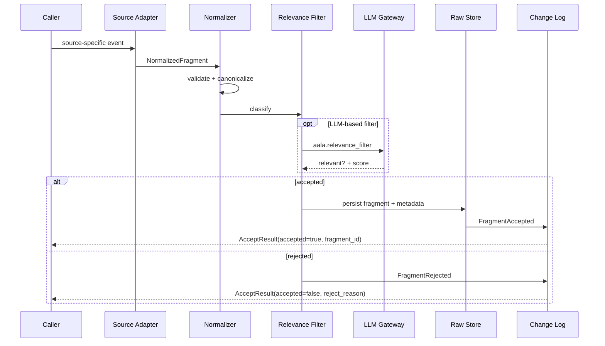

# L3 — Ingestion Components

For the container framing, see [`L2/02-ingestion.md`](../L2/02-ingestion.md). Ingestion turns "something happened out there" into a normalized, addressable fragment that the rest of the system can reason about.

## Component diagram

## Component reference

| Component | Responsibility | Internal state | Emits / consumes |
|---|---|---|---|
| **Source Adapters** | One per integration target. Translate the source's wire shape into a `NormalizedFragment`. Handle auth, rate limits, format quirks. | Per-adapter state (cursors, tokens, rate limit budgets). | In: source-specific events. Out: `NormalizedFragment`. |
| **Normalizer** | Validates and canonicalizes the `NormalizedFragment` shape. Ensures required fields (`message_id`, `sender`, `timestamp`, `content_kind`, `payload`) are present and typed. | None (stateless transform). | In: post-adapter fragments. Out: canonical fragments or `InvalidFragment` errors. |
| **Relevance Filter** | Pluggable classifier that drops content unlikely to yield useful atoms. Tunable bias: keep marginal content, drop only the obvious. | Pluggable classifier state (rule set, small model weights, or LLM call config). | Calls LLM Gateway with `aala.relevance_filter` when LLM-based. Out: accept/reject decision + reason. |
| **Raw Store** | Append-only durable archive of accepted fragments with metadata. Immutable once written. | All accepted fragments + their metadata. | Receives writes from Normalizer (after acceptance). Pure reads by `get` / `list`. |
| **Change Log** | Maintains the ordered, append-only event log. | Event sequence + ref / checkpoint surface. | Emits `FragmentAccepted` / `FragmentRejected`. Serves `changes_since(ref)` for telemetry consumers. |

## Internal flow — accept pipeline

## Tree-agnostic boundary

Ingestion does not assign atoms to trees. The `NormalizedFragment` shape preserves source semantics without committing to a tree; tree assignment happens downstream in Atoms (via extractor hints, `IngestOptions.target_tree` on `Orchestration.ingest`, or default tree configuration).

## Variation points

| Variation | Examples |
|---|---|
| Source adapter set | Manual file export only; +chat; +version-control; +doc store; +streaming STT for live capture. Each independently pluggable. |
| Normalization strictness | Strict (reject malformed); permissive (accept and tag problems). |
| Relevance filter implementation | None (everything passes); rules-only; small local classifier; LLM-based. |
| Raw store backend | Filesystem + metadata SQLite; object store + relational DB; committed-into-git; in-memory (tests). |
| Multi-tenancy | Per-tenant store prefix; per-tenant DB schema; logical namespace within a shared schema. |
