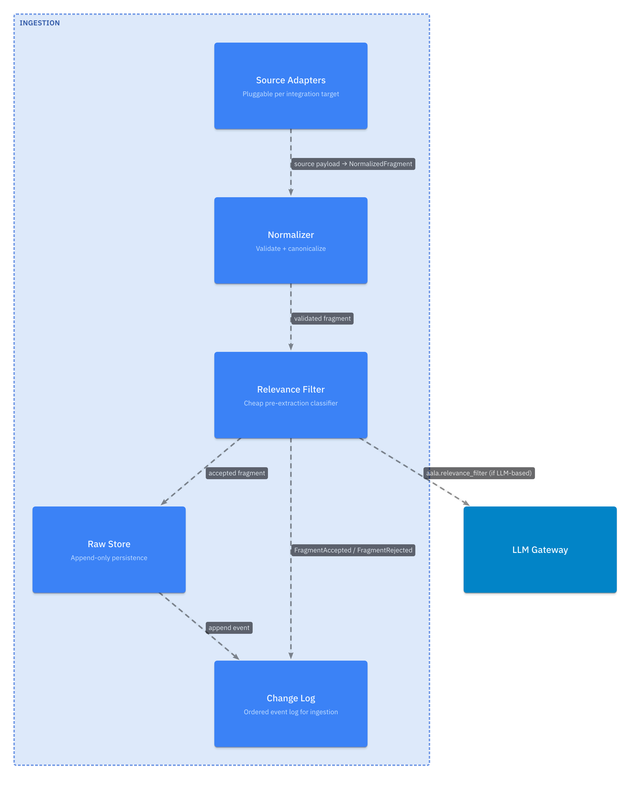
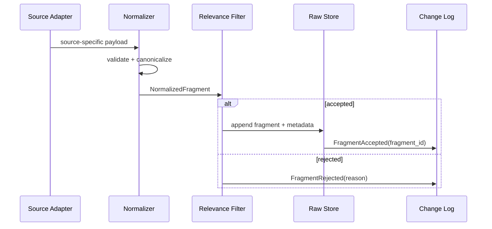

# L3 — Ingestion Components

For the container framing, see [`L2/02-ingestion.md`](../L2/02-ingestion.md). Ingestion accepts raw inputs from heterogeneous sources, normalizes them, optionally filters, and persists for provenance.

## Component diagram

## Component reference

| Component | Responsibility | Internal state | Emits / consumes |
|---|---|---|---|
| **Source Adapters** | Pluggable per integration target. Translates source-specific shapes into `NormalizedFragment`. One adapter per source. | None per-adapter (auth tokens live with the deployer's secrets layer). | Produces normalized fragments for the Normalizer. |
| **Normalizer** | Post-adapter step. Validates the fragment shape, canonicalizes structure, attaches stable `message_id`. | None. | In: per-source shapes. Out: validated `NormalizedFragment`. |
| **Relevance Filter** | Cheap classifier that drops content unlikely to yield useful atoms. Biased toward false positives. | Filter rules / model weights (impl-specific). | Decides accept / reject per fragment. |
| **Raw Store** | Durable, append-only persistence of every accepted fragment with full metadata. | Raw fragment bytes + per-fragment metadata. | Append-only writes; serves reads by `fragment_id`. |
| **Change Log** | Maintains the ordered, append-only event log for the container. | Event sequence. | Emits `FragmentAccepted` / `FragmentRejected`. Serves `changes_since(ref)`. |

## Internal flow

## Variation points

| Variation | Examples |
|---|---|
| Source adapter set | Manual file export only (smallest); chat platform + version-control + doc store (typical); + streaming STT (live capture). Each adapter independently optional. |
| Normalizer strictness | Reject-on-malformed (strict) vs. accept-with-warning (permissive). |
| Relevance filter | None; rule-based; small local classifier; LLM-based via [LLM Gateway](../L2/09-llm-gateway.md) using the `aala.relevance_filter` use-case key. |
| Raw store backend | Filesystem + SQLite metadata (local-first); blob store + relational DB (SaaS); committed-into-git (smallest setups, with size limits). |
