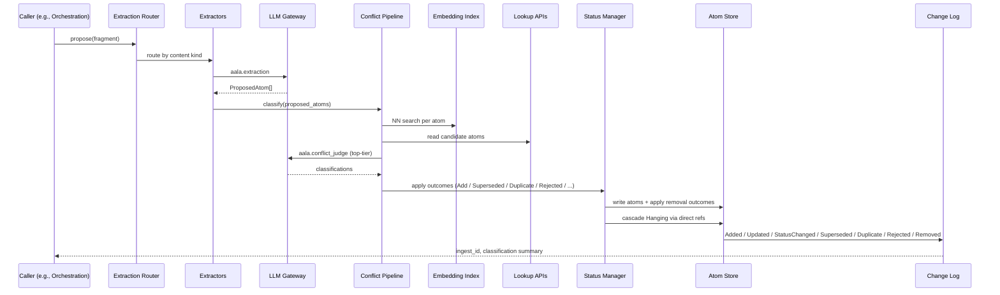
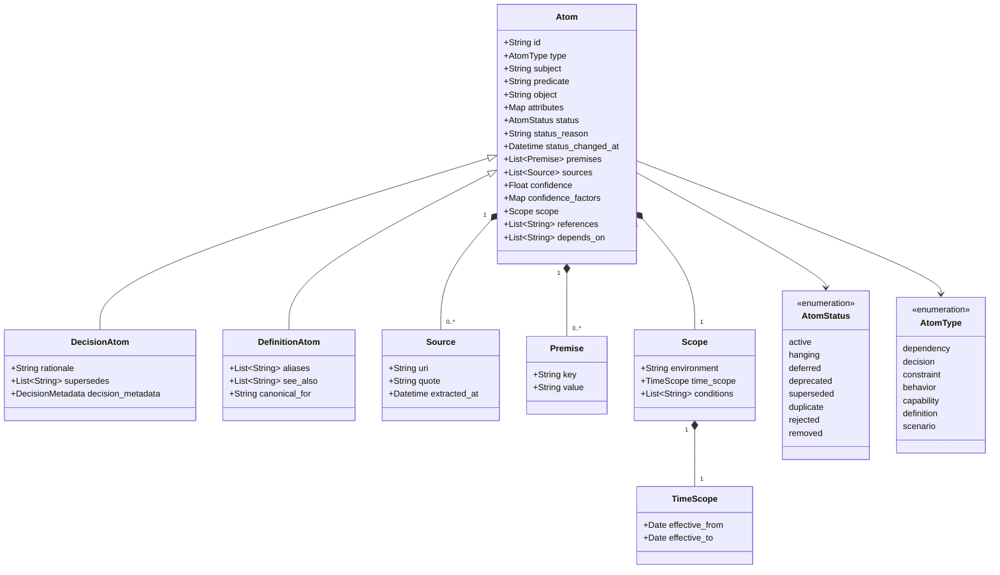

# L3 — Atoms Components

For the container framing, see [`L2/03-atoms.md`](../L2/03-atoms.md). Atoms owns the canonical schema for claims, the durable record, extraction, conflict detection, status transitions, alias / reference primitives, and the embedding-NN index. It is the largest L3 chapter because it absorbs Extraction and Conflict as primitives.

## Component diagram

## Component reference

| Component | Responsibility | Internal state | Emits / consumes |
|---|---|---|---|
| **Schema** | Defines atom shape and subtypes. Validates atoms on write. The single authority on what an atom is. | Schema versions (declared, not derived). | Used by Atom Store on write; by Extractors when shaping output. |
| **Atom Store** | Durable persistence of atoms in the current snapshot. Backend is implementation-specific. | The atoms themselves. | Receives writes from Status Manager (status) and Extraction (new). |
| **Extraction Router** | Picks which Extractor(s) handle a fragment based on its content kind. | Router config. | In: `NormalizedFragment` from caller. Out: routes to one or more Extractors. |
| **Extractors** | One per content kind: decision, definition, dependency, generic. Produces proposed atoms with provenance fields populated. | Prompt templates / patterns (impl-specific). | Calls LLM Gateway with `aala.extraction`. Out: `ProposedAtom[]`. |
| **Conflict Pipeline** | Classifies each proposed atom against canonical. Three stages: deterministic match → embedding NN → LLM judge. | Per-atom classification history. | Reads from Embedding Index + Atom Store. Calls LLM Gateway with `aala.conflict_judge`. Out: classifications. |
| **Embedding Index** | Internal NN store used only by Conflict's candidate-finding stage. Not exposed externally. | Atom embeddings keyed by atom id. | Calls LLM Gateway with `aala.embedding_default`. |
| **Status Manager** | The single mutation funnel for canonical atom state. Applies present-state transitions (`Active` / `Hanging` / `Deferred` / `Deprecated`) and removal outcomes (`Superseded` / `Duplicate` / `Rejected` / `Removed`, each with intent meta — `superseded_by`, `duplicate_of`, rationale). Drives the Hanging cascade via direct references after Conflict applies Supersedes / Refines. | None of its own (state lives on atoms). | Reads atoms; writes status or applies removal. Triggers Change Log `StatusChanged` / `Superseded` / `Duplicate` / `Rejected` / `Removed` events with full intent meta. |
| **Lookup APIs** | Serves read primitives: `get_by_id`, `list_scope`, `list_children`, `traverse_references`. | None. | Pure reads against Atom Store. |
| **Change Log** | Maintains the ordered, append-only event log for the container. | Event sequence + ref / checkpoint surface. | Emits `Added` / `Updated` / `StatusChanged` / `Deleted`. Serves `changes_since(ref)` for [Hierarchical Navigation](./06-hierarchical-nav.md), [Projection](./04-projection.md), [Blast Radius](./07-blast-radius.md), [Quality](./10-quality.md). |

## Internal flow — proposal pipeline

## Canonical data model

The schema below is the conceptual data model. Specific implementations may serialize it differently (YAML, JSON, protobuf, …). The interface contract for exact shape lives in `docs/interfaces/atoms.md`.

The atom lifecycle state machine (covering the `AtomStatus` transitions) is in [`L2/11-flows.md`](../L2/11-flows.md#atom-lifecycle-state-machine).

## Variation points

| Variation | Examples |
|---|---|
| Storage backend | YAML files in git (local-first); relational DB rows; object store + manifest. |
| Extractor set | Minimal (decision + definition + generic); full (+ dependency, capability, scenario, behavior, constraint). |
| Conflict pipeline depth | Deterministic-only (fast, low recall); +NN (medium); +LLM judge (highest fidelity). |
| Embedding model | Selected by the deployer's gateway config under `aala.embedding_default` use-case key. |
| Schema extensions | Custom atom subtypes for tenant-specific domains. The global schema defines the floor, not the ceiling. |
