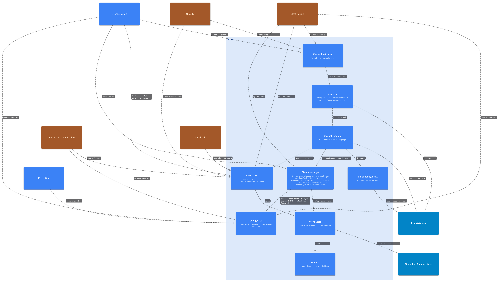
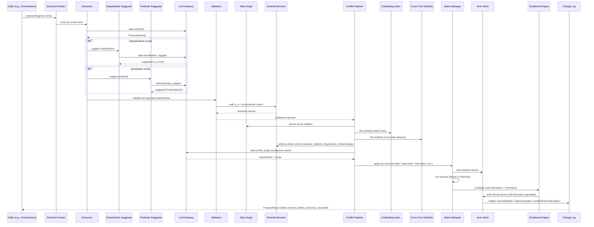
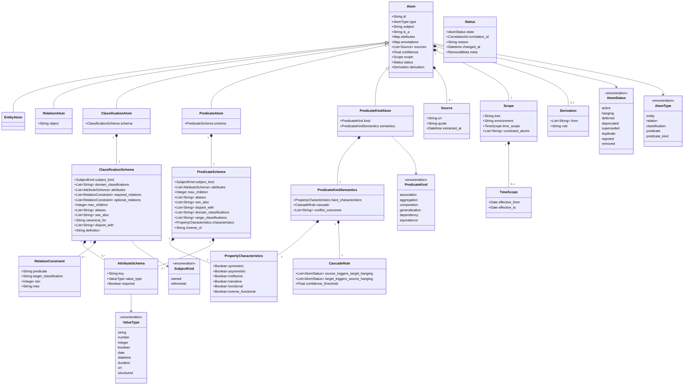

# L3 — Atoms Components

For the container framing, see [`L2/03-atoms.md`](../L2/03-atoms.md). Atoms owns the typed grammar for claims, the durable record, extraction, conflict classification, status transitions, cascade machinery, relation traversal, classification and predicate resolution, the alias graph, the cross-tree similarity index, and entailment computation.

It is the largest L3 chapter because it absorbs Extraction, Conflict, the Schema Resolver, the Entailment Engine, and the Status Manager as components inside one container. Atoms also implements the [Projection facet](./04-projection.md) (required) over its claims — canonical claim prose, the glossary, and a navigable index — as a second read surface alongside its structured read API.

## Component diagram

## Component reference

| Component | Responsibility | Internal state | Emits / consumes |
|---|---|---|---|
| **Schema** | Defines atom base shape and per-type rules. Validates atoms on write against the resolved classification schema (walked via Schema Resolver). | Schema versions (declared, not derived). | Used by Atom Store on write; by Extractors when shaping output. |
| **Atom Store** | Durable persistence of atoms in the current snapshot. Backend is implementation-specific. | The atoms themselves (asserted + derived). | Receives writes from Status Manager (status), Extractors (new asserted), Entailment Engine (new derived). |
| **Standard Library** | Pre-registered ClassificationAtoms and PredicateKindAtoms per tree. Initialized on tree creation; immutable as a baseline (deployments add but do not remove). | The pre-registered atoms per tree. | Read by Extractors, Schema Resolver, Conflict Pipeline, Validators. |
| **Extraction Router** | Picks which Extractor(s) handle a fragment based on its content kind and optional caller hints. | Router config. | In: `NormalizedFragment` from caller. Out: routes to one or more Extractors. |
| **Extractors** | Produce proposed atoms with provenance fields populated. Emit entity / relation / classification / predicate atoms. May call ClassificationSuggester or PredicateSuggester for novel terms. | Prompt templates / patterns (impl-specific). | Calls LLM Gateway with `aala.extraction`. Out: `ProposedAtom[]`. |
| **Classification Suggester** | For novel atoms without explicit classification, suggests a ClassificationAtom + is_a chain. | None. | Calls LLM Gateway with `aala.classification_suggest`. Out: suggested classification edge. |
| **Predicate Suggester** | For novel relationship surface forms, suggests a PredicateAtom + underlying PredicateKindAtom. | None. | Calls LLM Gateway with `aala.predicate_suggest`. Out: suggested PredicateAtom. |
| **Alias Graph** | Within-tree index supporting `resolve_subject` (prose → AtomId). Built from ClassificationAtom / PredicateAtom aliases plus EntityAtom names. | Per-tree alias index. | Receives updates from Atom Store via Change Log; queried by Conflict Pipeline (alias-resolution stage) and external `resolve_subject` calls. |
| **Schema Resolver** | Walks `is_a` chains for classifications and sub-predicate chains for predicates. Accumulates schema fields (attributes, required_relations, disjoint_with) and resolves `subject_kind` to the point it was fixed in the chain. Caches resolved schemas keyed by atom id. | Resolved-schema cache. | Reads Atom Store; cache invalidated by `ClassificationSchemaUpdated` / `PredicateSchemaUpdated` events. |
| **Conflict Pipeline** | 9-stage classification (structural validation → alias resolution → schema validation → duplicate / similarity → edge-specific structural → equivalence / alias coherence → capacity → promotion → cross-tree advisory). Produces structured outcomes with resolution modes. | Per-proposal classification context (ephemeral). | Reads Atom Store, Alias Graph, Schema Resolver, Embedding Index, Cross-Tree Similarity Index. Calls LLM Gateway with `aala.conflict_judge` for ambiguous cases. Out: outcomes. |
| **Embedding Index** | Internal NN store used by Conflict's similarity-detection stage. Not exposed externally. | Atom embeddings keyed by atom id. | Calls LLM Gateway with `aala.embedding_default`. |
| **Cross-Tree Similarity Index** | Surfaces `CrossTreeEquivalenceCandidate` outcomes by comparing new atoms against atoms in other trees. Advisory — never auto-merges. | Cross-tree embedding index. | Same embedding backbone as Embedding Index. |
| **Entailment Engine** | Computes T1 (transitive is_a, inverse_of materialization, alias closure), T2 (transitive composition/dependency/equivalence, symmetric expansion, cross-tree implications), T3 (disjointness propagation, functional violations producing conflict outcomes). Implementation chooses caching strategy (lazy / eager / hybrid). | Derived-atom materialization cache (impl-specific). | Reads Atom Store; writes derived atoms via Status Manager; emits `DerivedAdded` / `DerivedInvalidated` events. |
| **Status Manager** | The single mutation funnel for canonical atom state. Applies present-state transitions and removal outcomes. Runs the three-channel cascade fixpoint (predicate-kind, scope-premise, derivation-invalidation) on every transition. | None of its own (state lives on atoms). | Reads atoms; writes status. Triggers `ChangeEvent`s. Invokes Entailment Engine for derivation invalidation. |
| **Validators** | At proposal time: type-specific field requirements, subject treatment per classification's `subject_kind`, `is_a` target type per id-prefix rules (entity→classification, relation→predicate), schema-cumulative `required_relations`, predicate domain/range (and referential `domain_classifications`). | None. | Reads Schema Resolver outputs; raises `InvalidInput` or feeds outcomes into Conflict Pipeline. |
| **Lookup APIs** | Serves read primitives: `get_by_id`, `list_scope`, `list_children`, `list_by_classification`, `list_by_tree`, `resolve_subject`, `traverse_relations`, `get_classification_schema`, `get_predicate_schema`. | None. | Pure reads against Atom Store, Alias Graph, Schema Resolver. |
| **Change Log** | Maintains the ordered, append-only event log for the container. | Event sequence + ref / checkpoint surface. | Emits all atom events (Added, DerivedAdded, Updated, StatusChanged, Superseded, Duplicate, Rejected, Removed, Purged, DerivedInvalidated, ConflictOutcomeEmitted, ConflictOutcomeResolved, ClassificationSchemaUpdated, PredicateSchemaUpdated). Serves `changes_since(ref)` for [Hierarchical Navigation](./06-hierarchical-nav.md), [Blast Radius](./07-blast-radius.md), [Quality](./10-quality.md), and Atoms' own [Projection facet](./04-projection.md). |

## Internal flow — proposal pipeline

## Canonical data model

The schema below is the conceptual data model. Specific implementations may serialize it differently (YAML, JSON, protobuf, …). The exact interface shape lives in [`interfaces/00-shared-types.md`](../../interfaces/00-shared-types.md).

The atom lifecycle state machine (covering the `AtomStatus` transitions) is in [`L2/11-flows.md`](../L2/11-flows.md#atom-lifecycle-state-machine).

## Variation points

| Variation | Examples |
|---|---|
| Storage backend | YAML files in git (local-first); relational DB rows; object store + manifest. |
| Extractor set | Minimal (generic entity + relation only); typical (+ classification suggester + predicate suggester); deployment-custom. |
| Conflict pipeline depth | Structural-only (fast, low recall); +NN similarity (medium); +LLM judge for ambiguous (highest fidelity). |
| Entailment caching | Lazy (compute at query); eager (materialize at write); hybrid (cache hot derivations). |
| Embedding model | Selected by the deployer's gateway config under `aala.embedding_default`. |
| Standard library extensions | Deployments add custom ClassificationAtoms / PredicateAtoms beyond the standard library. |
| Cross-tree similarity strategy | Deterministic-only / embedding-driven / hybrid; controls precision/recall on `CrossTreeEquivalenceCandidate`. |
| Schema-resolver caching | Per-snapshot cache invalidated by schema updates; per-axiom invalidation; no caching (always walk). |
