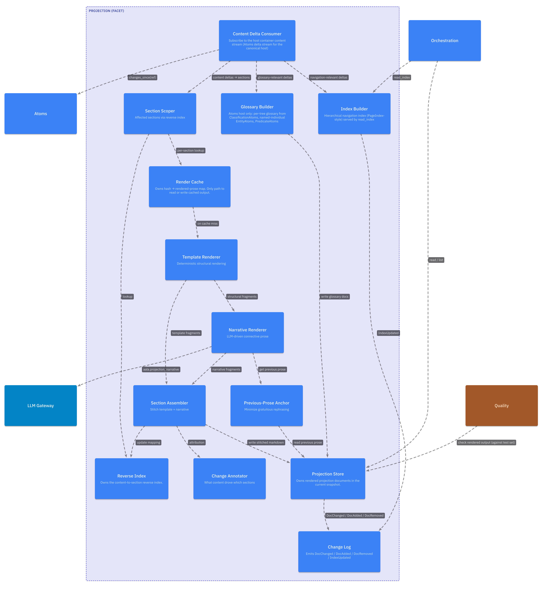
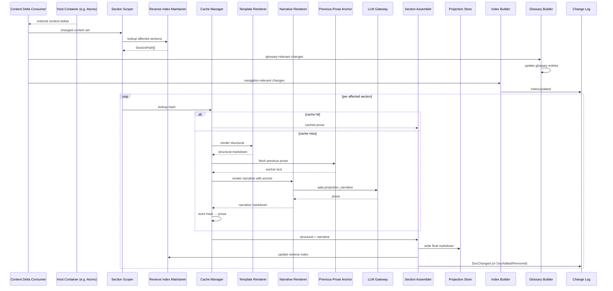

# L3 — Projection Facet Components

For the framing, see [`L2/04-projection.md`](../L2/04-projection.md). Projection is a cross-cutting **read facet**, not a container: each contentful container embeds this rendering pipeline over its own content. The canonical instance is [Atoms](./03-atoms.md), which renders claim prose + the glossary; other contentful containers may embed the same pipeline over their content. The components below describe that reusable pipeline.

## Component diagram

## Component reference

| Component | Responsibility | Internal state | Emits / consumes |
|---|---|---|---|
| **Content Delta Consumer** | Subscribes to the host container's own content change stream (for Atoms, the `changes_since(ref)` atom deltas). Tracks the last consumed `ref`. Routes events to Section Scoper, Glossary Builder, and Index Builder. | Per-snapshot consumer ref. | Consumes the host's content events. |
| **Section Scoper** | Uses the Reverse Index to determine which documents / sections are affected by a changed content set. Returns the minimal scope to re-render. | None (pure read against Reverse Index). | In: content-id set. Out: SectionPath set + driving-content map. |
| **Template Renderer** | Pure deterministic rendering of structural content (tables, fact lists, schema-derived sections). No LLM. | Template definitions per section type. | In: content subset for a section. Out: structural markdown. |
| **Narrative Renderer** | LLM-driven rendering of connective prose between structural sections. Uses the Previous-Prose Anchor. | None (stateless transform). | Calls LLM Gateway with `aala.projection_narrative`. Out: prose markdown. |
| **Previous-Prose Anchor** | Passes the previous rendering of the section to the Narrative Renderer with a "preserve unchanged wording" instruction. Critical for deterministic diffs. | Anchor cache (last rendered prose per section). | Read by Narrative Renderer. |
| **Cache Manager** | Looks up by hash `(content_set + prompt_version + model_version)`. On hit, returns cached prose; on miss, drives the renderers and caches the result. | Render cache. | Drives the renderer pipeline. |
| **Section Assembler** | Stitches template + narrative output into a final markdown document. Writes to the Projection Store. | None. | In: rendered template + narrative. Out: assembled markdown; writes to Projection Store. |
| **Projection Store** | Persistence layer for rendered documents in the current snapshot. Backend is implementation-specific. | The rendered files. | Receives writes from Section Assembler. Pure reads by `read` / `list`. |
| **Reverse Index Maintainer** | Updates the content-to-section index as documents are written. Lets Section Scoper answer "which sections does content unit X appear in?". | Content → SectionPath[] mapping. | Updates after Section Assembler writes. |
| **Index Builder** | Maintains the hierarchical navigation index (titled, summarized nodes) served by `read_index`. Synthesizes node titles/summaries (LLM-assisted) for PageIndex-style descent. | Navigation tree per snapshot. | In: content events from Content Delta Consumer. Out: `ProjectionIndex` via `read_index()`. Emits `IndexUpdated`. |
| **Glossary Builder** (Atoms only) | Produces glossary entries from ClassificationAtoms (concept entries), EntityAtoms classified under named-individual classifications (Person, Organization, Place, Time, Concept), and PredicateAtoms (predicate entries). Incrementally updated from the Atoms delta stream. Per tree. | Glossary entry cache per tree. | In: atom events from Content Delta Consumer. Out: glossary documents. |
| **Change Annotator** | Records which content units triggered which section re-renders. Consumed by clients that want to surface "what changed and why." | Annotation log. | Receives from Section Assembler. |
| **Change Log** | Maintains the ordered, append-only event log for the facet. | Event sequence + ref / checkpoint surface. | Emits `DocChanged` / `DocAdded` / `DocRemoved` / `IndexUpdated`. Serves `changes_since(ref)`. |

## Internal flow — incremental re-render

## Variation points

| Variation | Examples |
|---|---|
| Rendering mode | Template-only (no LLM); template + cached LLM narrative (default); streaming projection. |
| Projection schema | One document per entity / scope; one per scope (coarse); one large document. |
| Index granularity | Flat list; per-scope outline; deep PageIndex-style tree with per-node summaries. |
| Cache backend | In-memory only; file-backed; external KV store. |
| Anchor strategy | Always anchor; anchor only stable sections; never anchor. |
| Glossary placement (Atoms) | Per-tree glossary document; combined cross-tree glossary; embedded into domain index pages. |
| Derived-atom rendering | Hidden (default); per-section opt-in; full diagnostic mode. |
| Facet host | Atoms (canonical); Ingestion; Blast Radius; Hierarchical Navigation. |
