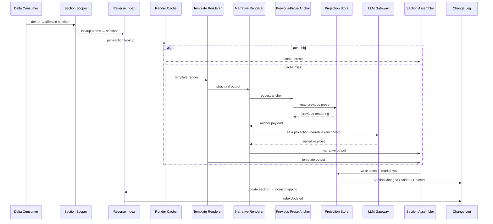

# L3 — Projection Components

For the container framing, see [`L2/04-projection.md`](../L2/04-projection.md). Projection turns the structured atom set into a structured prose set, with deterministic rendering, aggressive caching, and per-section scoping.

## Component diagram

## Component reference

| Component | Responsibility | Internal state | Emits / consumes |
|---|---|---|---|
| **Delta Consumer** | Subscribes to Atoms's delta stream via `changes_since(ref)`. Drives the rest of the pipeline on each delta batch. | Per-snapshot consumer checkpoint `ref`. | In: ordered Atoms delta events. Out: drives Section Scoper. |
| **Section Scoper** | Uses the Reverse Index to identify which projection files + sections are affected by a given atom set. | None. | Reads Reverse Index. Out: section-write plan. |
| **Template Renderer** | Pure function. Deterministically renders structural content (tables, fact lists, schema-derived sections). No LLM. | None. | In: atoms for the section. Out: deterministic markdown fragments. |
| **Narrative Renderer** | LLM-driven. Renders connective prose for narrative zones, anchored against the previous prose. | None of its own. | Calls LLM Gateway with `aala.projection_narrative`. Reads from Previous-Prose Anchor. Out: prose fragments. |
| **Previous-Prose Anchor** | Provides the previous rendering of the section to the narrative renderer with a "preserve unchanged wording" instruction. | None. | Reads previous projection via Projection Store. Out: anchor payload for the renderer. |
| **Render Cache** | Owns the hash → rendered-prose map. The only path to read or write cached output. | The cache itself. | Read by Section Scoper on cache-lookup; written by the assembler / renderer pipeline on cache-miss completion. |
| **Section Assembler** | Stitches template + narrative output into a final markdown section. | None. | Combines outputs from Template + Narrative renderers. Writes via Projection Store. |
| **Projection Store** | Owns rendered projection files in the current snapshot. The only component allowed to mutate or serve projection state. Persistence is implementation-specific. | Rendered markdown files. | Mutated by Section Assembler; read by Previous-Prose Anchor and external callers via the Read API. Triggers `SectionChanged` / `SectionAdded` / `SectionDeleted` events to Change Log. |
| **Reverse Index** | Owns the claim-to-section reverse index. The only component allowed to mutate or serve the index. | The reverse index itself. | Read by Section Scoper; updated by Section Assembler. Triggers `IndexUpdated` events to Change Log. |
| **Change Annotator** | Records which atoms triggered which section re-renders (for "what changed and why" attribution). | Per-render attribution log. | Read by clients that surface the why. |
| **Change Log** | Maintains the ordered, append-only event log. | Event sequence + checkpoint surface. | Emits `SectionChanged` / `SectionAdded` / `SectionDeleted` / `IndexUpdated`. Serves `changes_since(ref)`. |

## Internal flow — section re-render

## Variation points

| Variation | Examples |
|---|---|
| Rendering mode | Template-only (no LLM, fastest, least fluent); template + cached LLM narrative (default); streaming projection (incremental output for live capture). |
| Projection schema | One file per entity / service / decision (fine-grained); one file per scope (coarse); single large generated document (smallest setups). |
| Cache backend | In-memory only; file-backed; external KV store. |
| Anchor strategy | Always anchor on the previous rendering; anchor only on high-confidence stable sections; never anchor. |
| Glossary projection | The alphabetical glossary page rendered from `definition`-type atoms with their aliases + see-also cross-references is one of Projection's outputs — not a separate container. |
