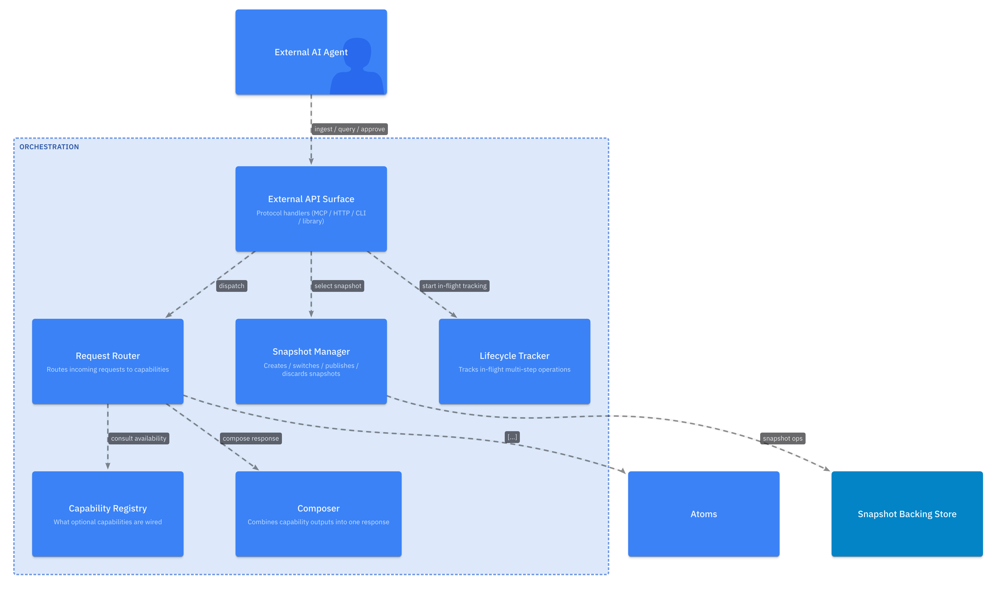
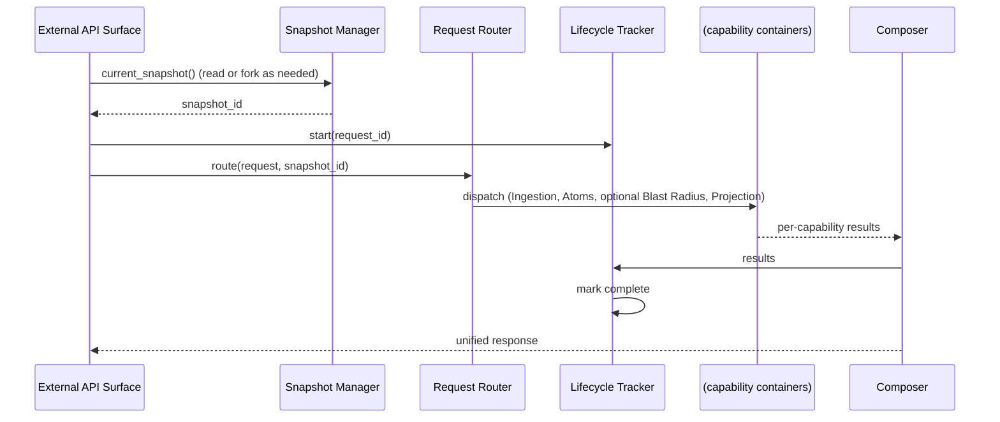

# L3 — Orchestration Components

For the container framing, see [`L2/05-orchestration.md`](../L2/05-orchestration.md). Orchestration is the seam between the outside world and aala's capability containers. It owns snapshot lifecycle and request routing.

## Component diagram

## Component reference

| Component | Responsibility | Internal state | Emits / consumes |
|---|---|---|---|
| **Snapshot Manager** | Creates, switches, publishes, discards snapshots. Owns snapshot identity and lineage. The single authority on "which snapshot is current." | Snapshot lineage graph (working snapshots, their parents, canonical ancestors). | Emits snapshot lifecycle events. Drives capability containers' `changes_since(ref)` baselines on switch. |
| **External API Surface** | The protocol-level handlers for incoming requests. Realization varies (MCP tool handlers, HTTP routes, CLI commands, library API). | None. | In: external requests. Out: dispatches to Request Router. |
| **Request Router** | For an incoming request (ingest, query, render trigger), decides which capability container(s) handle it. Includes content-kind → extractor routing for ingests and intent → capability routing for queries. | Routing config. | In: parsed request. Out: capability invocation plan. |
| **Lifecycle Tracker** | Tracks in-flight operations that span multiple capability calls (e.g., an ingest that runs Ingestion + Atoms + Projection + optional Blast Radius). | Per-request lifecycle state. | Read by external API for status queries. |
| **Capability Registry** | Startup-time discovery of which optional capabilities are wired up in this deployment. Runtime "what's available" queries. | Capability map (capability id → version + operability status). | Read by Request Router and by [Synthesis](./08-synthesis.md) at request time to decide degradation. |
| **Composer** | Combines outputs of multiple capability calls into a single response shape for the external caller. | None. | In: per-capability results. Out: unified response. |

## Internal flow — ingest request

## Variation points

| Variation | Examples |
|---|---|
| External API style | MCP server (local-MCP); HTTP + WebSocket (SaaS); CLI subcommands (batch / CI); library API (embedded). |
| Snapshot backend | Git refs + working tree (local-first); versioning column in a relational DB; content-addressed manifest store; in-memory immutable structures (tests). |
| Canonicalization model | aala-managed (publish_as_canonical actively promotes); externally-managed (publish is a no-op; aala observes external commits). |
| Routing strategy | Static config-driven; capability-version-aware; ML-routed. |
| Concurrency model | Single working snapshot (serialized writes); multiple working snapshots per session / branch (concurrent writes with conflict reconciliation on merge). |
| Lifecycle semantics | Fully synchronous (entry-point call returns when every downstream capability completes); asynchronous with a polling API; event-streamed. |
