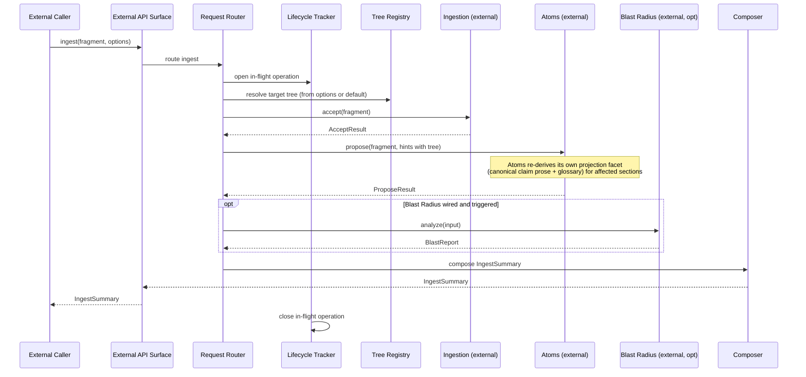

# L3 — Orchestration Components

For the container framing, see [`L2/05-orchestration.md`](../L2/05-orchestration.md). Orchestration decides which snapshot is "now", which trees exist, and which capability handles a given request.

## Component diagram

## Component reference

| Component | Responsibility | Internal state | Emits / consumes |
|---|---|---|---|
| **Snapshot Manager** | Creates, switches, publishes, discards snapshots. Single owner of snapshot identity and lineage. Realizations vary by implementation (git ref + working tree, versioning DB row, content-addressed manifest, in-memory immutable). | Current working snapshot id; lineage graph. | Emits `SnapshotForked` / `SnapshotSwitched` / `SnapshotPublished` / `SnapshotDiscarded`. |
| **Tree Registry** | Registers, lists, renames trees. Triggers Atoms to initialize the standard library (ClassificationAtoms + PredicateKindAtoms) for new trees. Owns tree-level metadata (display name, description). | Registered tree list per snapshot. | Emits `TreeRegistered` / `TreeRenamed`. |
| **External API Surface** | The protocol surface external callers talk to. Realization varies (MCP tool handlers, HTTP routes, CLI commands, embedded library). | None inherently. | Routes inbound calls to internal components; serializes outbound responses. |
| **Request Router** | For an incoming request, decides which capability containers handle it. Includes extractor routing by content kind, read dispatch (structured Atoms reads and projection-facet reads: `list` / `read` / `read_index`), tree assignment for ingest. | Router configuration. | Drives downstream capability calls. |
| **Lifecycle Tracker** | Manages in-flight state for multi-step operations (an ingest that spans Ingestion + Atoms + the host re-deriving its projection facet + optional Blast Radius). | In-flight operation map. | Updated by each capability completion event. |
| **Capability Registry** | Startup-time discovery; runtime "what's wired" queries. Used by clients and external agents for graceful degradation reasoning. | Capability list with versions + wired flags; the set of containers exposing the projection facet. | Read by `capabilities()` API and by request-routing logic. |
| **Composer** | Combines the outputs of multiple capabilities into a single response shape for the external caller (e.g., an ingest response that includes Ingestion's fragment_id, Atoms's ProposeResult, Blast Radius's report, and the affected projection-facet sections). | None (stateless transform). | Stateless aggregation. |
| **Change Log** | Maintains the ordered, append-only event log for the container. | Event sequence + ref / checkpoint surface. | Emits snapshot lifecycle events and tree lifecycle events. Serves `changes_since(ref)` for any external observer (typically clients reacting to snapshot transitions). |

## Internal flow — ingest dispatch

## Variation points

| Variation | Examples |
|---|---|
| External API style | MCP server; HTTP + WebSocket; CLI subcommands; library API (embedded). |
| Snapshot backend | Git refs + working tree; versioning column in relational DB; content-addressed manifest store; in-memory immutable structures (tests). |
| Canonicalization model | aala-managed (`publish_as_canonical` mutates a head pointer); externally-managed (publish is a no-op or detection-only; aala observes external promotion). |
| Tree registry persistence | Alongside atoms in the snapshot; container-internal; external configuration. |
| Routing strategy | Static config-driven; capability-version-aware; dynamic / ML-routed. |
| Concurrency model | Single working snapshot (serialized writes); multiple working snapshots per user / branch / session (concurrent writes). |
| Lifecycle semantics | Fully synchronous; asynchronous with polling; event-streamed. |
| In-flight tracking persistence | In-memory only (loses on restart); persisted (recoverable). |
