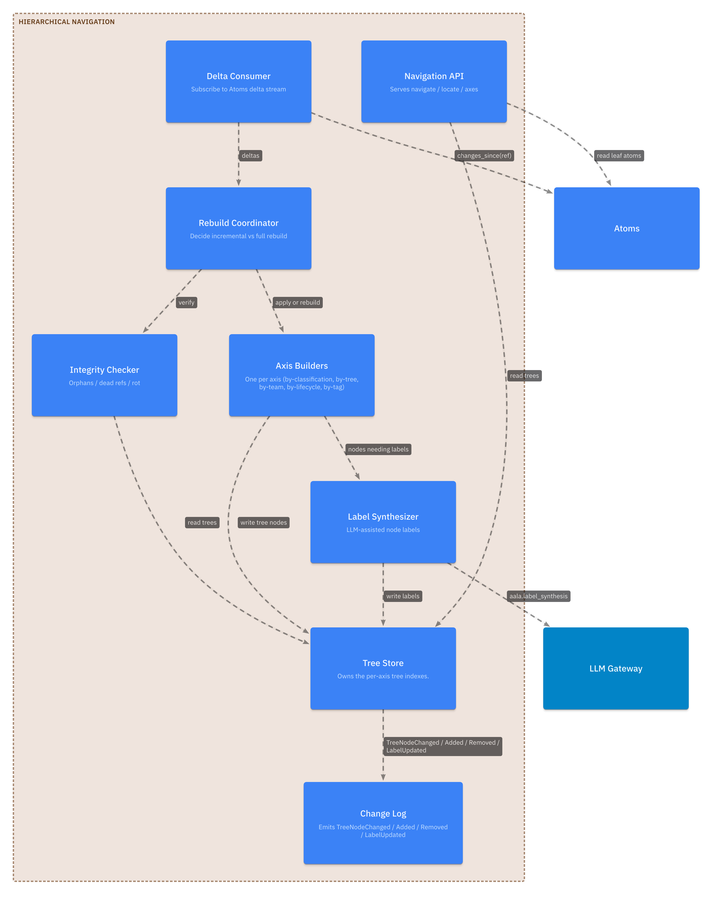
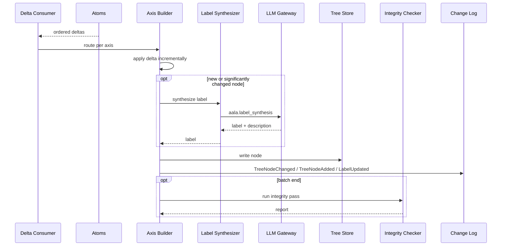

# L3 — Hierarchical Navigation Components

For the container framing, see [`L2/06-hierarchical-nav.md`](../L2/06-hierarchical-nav.md). Hierarchical Navigation gives LLMs and humans a labeled-tree way into the atom set, with multiple lenses on the same atoms.

## Component diagram

## Component reference

| Component | Responsibility | Internal state | Emits / consumes |
|---|---|---|---|
| **Delta Consumer / Rebuild Coordinator** | Subscribes to Atoms's `changes_since(ref)` stream. Per-axis, tracks the last consumed `ref`. Routes events to the appropriate Axis Builders. Also handles full rebuild from scratch when `rebuild` is invoked. | Per-axis consumer ref. | Consumes Atoms events; drives Axis Builders. |
| **Axis Builders** | One per axis. Each knows how to derive its tree shape from atoms and how to apply individual delta events incrementally. Common axes: `by-classification` (walks `is_a` chains), `by-tree` (groups by `Scope.tree`), `by-team`, `by-lifecycle`, `by-tag`. | Per-axis tree index. | In: delta events. Out: tree node mutations. Calls Label Synthesizer for new / changed nodes. |
| **Label Synthesizer** | LLM-assisted node-label generation. Produces human-readable labels and short descriptions for internal tree nodes. | Label cache. | Calls LLM Gateway with `aala.label_synthesis`. |
| **Integrity Checker** | Runs after applying a delta batch (or after a full rebuild). Produces a structural-rot report listing orphans (atoms not placed in any tree) and dead refs (tree nodes pointing at deleted atoms). | None. | Reads tree indexes; produces `IntegrityReport`. |
| **Navigation API** | Serves `navigate` / `locate` / `axes` calls against the built trees. | None. | Pure reads. |
| **Tree Store** | Durable persistence of the per-axis tree indexes. Implementation choice: alongside atoms in the snapshot, or container-internal cache. | Per-axis trees. | Receives writes from Axis Builders. |
| **Change Log** | Maintains the ordered, append-only event log for the container. | Event sequence + ref / checkpoint surface. | Emits `TreeNodeAdded` / `TreeNodeChanged` / `TreeNodeRemoved` / `LabelUpdated`. Serves `changes_since(ref)`. |

## Internal flow — incremental rebuild

## The `by-classification` axis

The `by-classification` axis is the most distinctive: it directly mirrors the ClassificationAtom `is_a` hierarchy. Each ClassificationAtom becomes a node; classified EntityAtoms appear at their primary classification's node. Sub-categories appear as child nodes.

This axis serves as the navigation analog of the Glossary projection — same source data (ClassificationAtoms + their classified entities), different presentation (tree descent vs. A-to-Z listing).

## The `by-tree` axis

The `by-tree` axis groups atoms by `Scope.tree`. Each registered tree becomes a top-level node; atoms in the tree appear underneath. Cross-tree `kind=equivalence` RelationAtoms can be surfaced as horizontal connectors between subtrees.

This axis is distinct from the broader "tree partition" concept: the `Scope.tree` value is structural data on every atom; the `by-tree` axis is just one navigation surface over that data.

## Variation points

| Variation | Examples |
|---|---|
| Axis set | Minimal (by-classification only); typical (+by-tree, +by-team); full (+by-lifecycle, +by-tag, +custom). |
| Rebuild mode | Eager on every snapshot change; lazy on first navigation; scheduled; on-demand. |
| Label synthesis | LLM-based with caching (default); rule-based labels from atom metadata; no labels (raw path segments). |
| Integrity check depth | None; basic (orphans + dead refs); deep (cycle detection across axes). |
| Persistence | In-snapshot; container-internal cache. |
| Cross-tree connector display in `by-tree` axis | Hidden; shown on demand; always shown. |
