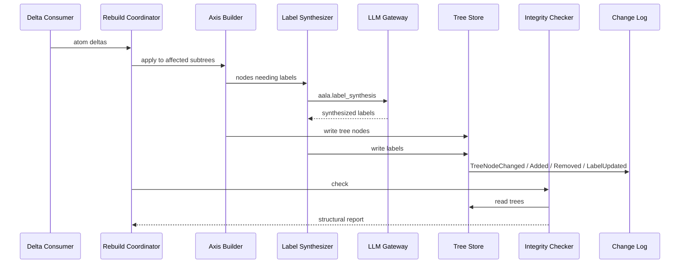

# L3 — Hierarchical Navigation Components

For the container framing, see [`L2/06-hierarchical-nav.md`](../L2/06-hierarchical-nav.md). Hierarchical Navigation builds and serves multi-axis labeled tree indexes over atoms (by-domain / by-team / by-lifecycle / by-tag).

## Component diagram

## Component reference

| Component | Responsibility | Internal state | Emits / consumes |
|---|---|---|---|
| **Delta Consumer** | Subscribes to Atoms's delta stream via `changes_since(ref)`. Translates atom-level deltas into tree-level mutations to apply. | Per-axis consumer checkpoint `ref`. | In: ordered Atoms delta events. Out: drives Axis Builders + Rebuild Coordinator. |
| **Axis Builders** | One builder per axis (by-domain, by-team, by-lifecycle, by-tag). Derives tree shape from atom fields and writes nodes via Tree Store. | None of their own. | Reads from Atoms; writes to Tree Store. |
| **Label Synthesizer** | Generates LLM-assisted human-readable labels for internal tree nodes ("Payments domain — handles transaction lifecycle" rather than the raw segment `payments`). | None. | Calls LLM Gateway with `aala.label_synthesis`. Writes labels via Tree Store. |
| **Rebuild Coordinator** | Receives snapshot-change notifications. Decides whether to apply deltas incrementally (steady state) or rebuild from scratch (after a snapshot switch). | None. | In: snapshot change. Out: directs Axis Builders. |
| **Tree Store** | Owns the per-axis tree indexes (the trees themselves + their synthesized labels). The only component allowed to mutate or serve tree state. Persistence is implementation-specific. | Tree indexes. | Mutated by Axis Builders + Label Synthesizer; read by Navigation API + Integrity Checker. Triggers `TreeNodeChanged` / `TreeNodeAdded` / `TreeNodeRemoved` / `LabelUpdated` events to Change Log. |
| **Integrity Checker** | Runs after applying a delta batch or after a full rebuild. Detects orphans, dead refs, structural rot. | None. | Reads via Tree Store. Out: structural-rot report. |
| **Navigation API** | Serves `navigate(axis, path)` and `locate(axis, atom_id)` against the built trees. | None. | Pure reads via Tree Store + atom reads via Atoms's Lookup APIs. |
| **Change Log** | Maintains the ordered, append-only event log. | Event sequence. | Emits `TreeNodeChanged` / `TreeNodeAdded` / `TreeNodeRemoved` / `LabelUpdated`. Serves `changes_since(ref)`. |

## Internal flow — incremental update

## Variation points

| Variation | Examples |
|---|---|
| Axis set | Minimal (by-domain only); typical (by-domain + by-team + by-lifecycle); full (+ by-tag and deployment-custom axes). |
| Rebuild mode | Eager on every snapshot change; lazy on first navigation after a change; scheduled; on-demand only. |
| Label synthesis | LLM-based with caching (default); rule-based labels from atom metadata; no labels (raw path segments). |
| Integrity check depth | None; basic (orphans + dead refs); deep (consistency between axes, cycle detection). |
| Tree persistence | Stored alongside atoms in the snapshot; container-internal cache only. |
