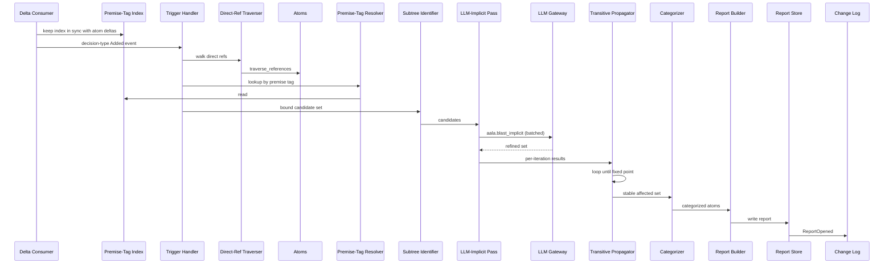
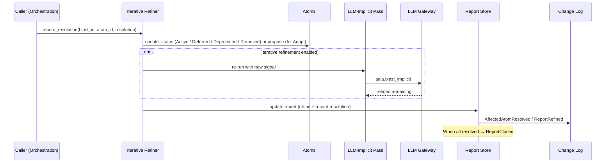

# L3 — Blast Radius Components

For the container framing, see [`L2/07-blast-radius.md`](../L2/07-blast-radius.md). Blast Radius computes the set of atoms affected by a sweeping decision and tracks resolution as humans work through it.

## Component diagram

## Component reference

| Component | Responsibility | Internal state | Emits / consumes |
|---|---|---|---|
| **Delta Consumer** | Subscribes to Atoms's delta stream. Detects decision-type `Added` events to trigger fresh analysis; consumes `StatusChanged` events on affected atoms to drive iterative refinement. | Per-snapshot consumer checkpoint `ref`. | In: Atoms delta events. Out: drives Trigger Handler. |
| **Trigger Handler** | Entry point. Receives decision-atom events; starts a new blast analysis. | None. | Out: routes work into the analysis pipeline. |
| **Direct-Ref Traverser** | Walks explicit `depends_on` / `references` edges via [Atoms](./03-atoms.md)'s reference-traversal primitive. The cheapest reliable detection. | None. | Out: directly-affected atom set. |
| **Premise-Tag Resolver** | Finds atoms tagged with the now-changed premise. | None of its own. | Reads from Premise-Tag Index. Out: premise-affected atom set. |
| **Premise-Tag Index** | Owns the `premise-tag → atoms` reverse index. The only component allowed to mutate or serve premise-index state. | The index itself. | Mutated by Delta Consumer as atoms change; read by Premise-Tag Resolver. |
| **Subtree Identifier** | Bounds the candidate set for the implicit pass — avoids scanning unrelated entities. | None. | Out: candidate subtree. |
| **LLM-Implicit Pass** | For each candidate atom, asks "does this still hold under the new premise?". Batched aggressively. | None. | Calls LLM Gateway with `aala.blast_implicit`. Out: refined candidate set. |
| **Transitive Propagator** | Re-runs the pipeline on newly-affected atoms until a fixed point. Premise change → affects atom X → atom X is itself a premise → loop until stable. | Per-iteration affected set. | Out: stable affected set. |
| **Categorizer** | Groups affected atoms by detection mechanism (direct / premise / implicit) and by suggested action (keep / adapt / deprecate / remove / defer). | None. | Out: categorized affected set. |
| **Report Builder** | Composes blast reports from the categorized set. | None of its own. | Writes via Report Store. |
| **Report Store** | Owns blast reports + iterative-refinement history. The only component allowed to mutate or serve report state. Persistence is implementation-specific. | Reports + refinement history. | Mutated by Report Builder + Iterative Refiner; read by external callers via the Read API. Triggers `ReportOpened` / `ReportRefined` / `ReportClosed` events to Change Log. |
| **Iterative Refiner** | Receives `record_resolution` calls. Updates the report via Report Store. Optionally re-runs the implicit pass with new human-supplied signal. Translates each resolution into a single call against [Atoms](./03-atoms.md): `update_status(atom_id, Active / Deferred / Deprecated / Removed, rationale)` for Keep / Defer / Deprecate / Remove, or `propose(...)` for Adapt. | None of its own. | Triggers `AffectedAtomResolved` events. |
| **Change Log** | Maintains the ordered, append-only event log. | Event sequence. | Emits `ReportOpened` / `AffectedAtomResolved` / `ReportRefined` / `ReportClosed`. Serves `changes_since(ref)`. |

## Internal flow — initial analysis

## Internal flow — iterative refinement

## Variation points

| Variation | Examples |
|---|---|
| Pipeline depth | Direct refs only (fast, low recall); +premise tags (medium); +LLM-implicit (full). |
| Implicit-pass model tier | Top-tier (highest fidelity); mid-tier with self-check; small local model for privacy-constrained tenants. Selected via `aala.blast_implicit` use-case key. |
| Iteration policy | Single-pass; fixed N iterations; iterative until fixed point. |
| Subtree scoping | Conservative (more LLM calls, fewer misses); aggressive (cheaper, may miss). |
| Report persistence | In the snapshot alongside atoms (default); container-internal only; emitted as events. |
