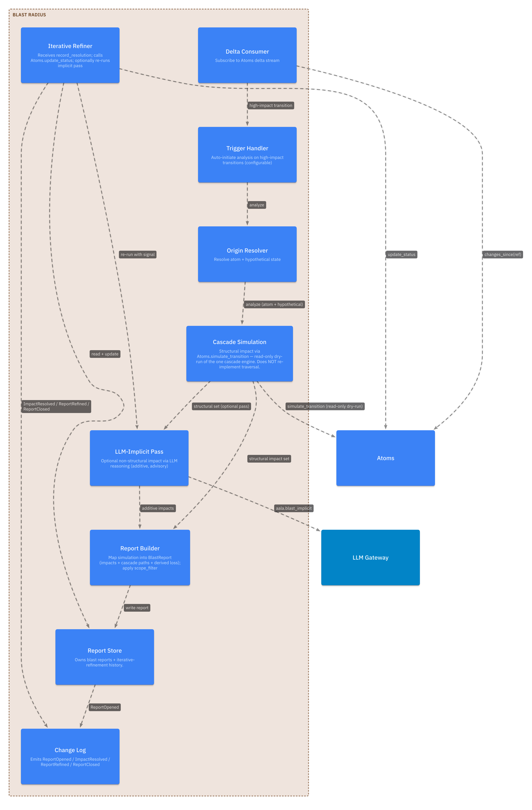
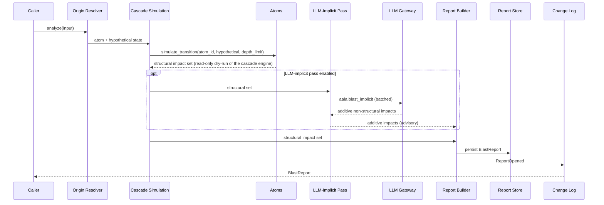
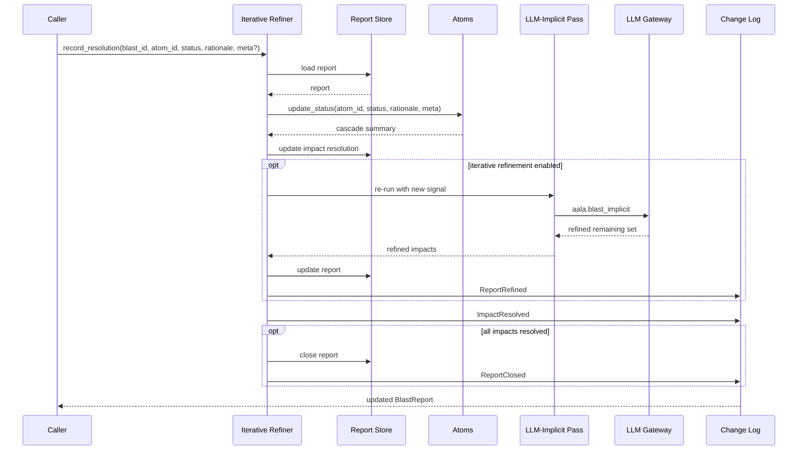

# L3 — Blast Radius Components

For the container framing, see [`L2/07-blast-radius.md`](../L2/07-blast-radius.md). Blast Radius answers "what else changes when this atom transitions?" and tracks the answer as humans resolve each impact.

## Component diagram

## Component reference

| Component | Responsibility | Internal state | Emits / consumes |
|---|---|---|---|
| **Delta Consumer** | Subscribes to Atoms's `changes_since(ref)` stream. Tracks the last consumed `ref`. Filters for transition events relevant to open reports (feeds Iterative Refiner) and high-impact transitions that may trigger automatic analysis. | Per-snapshot consumer ref. | Consumes Atoms events. |
| **Trigger Handler** | When the Delta Consumer surfaces a transition with broad downstream impact (sweeping decisions, classification changes affecting many descendants), MAY initiate a fresh analysis. Configurable per deployment. | Configuration thresholds. | Drives Analyze Pipeline. |
| **Origin Resolver** | First stage of the analyze pipeline. Resolves the input `atom_id` to a canonical atom; rejects if not found. Computes the hypothetical state when supplied. | None. | Reads Atoms. |
| **Cascade Simulation** | Obtains the structural impact set from `Atoms.simulate_transition(atom_id, hypothetical, { depth_limit })` — the read-only dry-run of the one cascade engine (three channels + cross-tree `kind=equivalence` expansion + composition confidence gate, run to fixpoint). Does **not** re-implement the traversal; the structural set therefore matches the real lifecycle cascade by construction. | None. | Calls `Atoms.simulate_transition`. |
| **LLM-Implicit Pass** | For each candidate atom (bounded by subtree scoping), asks: "does this still hold under the proposed transition?" Batched aggressively. Optional and configurable; **additive and advisory** — outside the structural-equivalence guarantee. | None. | Calls LLM Gateway with `aala.blast_implicit`. |
| **Report Builder** | Produces the persisted `BlastReport` with impacts, derived_loss, iteration count, and cascade paths. | None. | Writes to Report Store. |
| **Report Store** | Durable persistence of blast reports. Implementation choice: alongside atoms in the snapshot, or container-internal. | The reports themselves. | Receives writes from Report Builder + Iterative Refiner. Pure reads by `get_report` / `list_reports`. |
| **Iterative Refiner** | Receives `record_resolution` calls. Translates the resolution into `Atoms.update_status`. Updates the report. Optionally re-runs the LLM-Implicit Pass with the new resolution as signal. | None. | Calls Atoms; may call LLM Gateway. |
| **Change Log** | Maintains the ordered, append-only event log for the container. | Event sequence + ref / checkpoint surface. | Emits `ReportOpened` / `ImpactResolved` / `ReportRefined` / `ReportClosed`. Serves `changes_since(ref)`. |

## Internal flow — analyze pipeline

## Internal flow — record_resolution

## Variation points

| Variation | Examples |
|---|---|
| Pipeline depth | Structural-only (from `simulate_transition`, fast and exact); + LLM-implicit pass (additive, advisory, full coverage). |
| Implicit-pass model tier | Top-tier LLM; mid-tier with self-check; small local model for privacy-constrained tenants. |
| Iteration policy | Owned by the cascade engine — `simulate_transition` runs the fixpoint; not a Blast Radius variation. |
| Subtree scoping | Conservative (large candidate set); aggressive (tighter scoping, may miss). |
| Report persistence | In-snapshot; container-internal only; emitted as events to external storage. |
| Composition cascade threshold | Applied by the cascade engine (default 0.8, deployment-overridable); `simulate_transition` excludes below-threshold composition edges. |
| Trigger Handler activation | Manual only (via `analyze` call); auto on configured transition types; auto on all transitions. |
