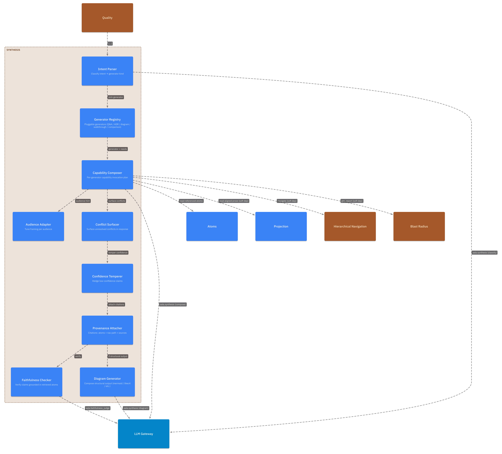
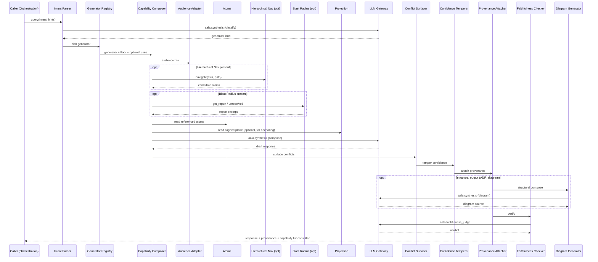

# L3 — Synthesis Components

For the container framing, see [`L2/08-synthesis.md`](../L2/08-synthesis.md). Synthesis composes multiple capabilities into a single response with provenance — Q&A, ADR drafts, sequence diagrams, walkthroughs, comparisons.

## Component diagram

## Component reference

| Component | Responsibility | Internal state | Emits / consumes |
|---|---|---|---|
| **Intent Parser** | Classifies the incoming intent into a generator kind. May be rule-based, LLM-driven, or hybrid. | None. | Calls LLM Gateway with `aala.synthesis` for LLM-driven classification. |
| **Generator Registry** | Pluggable generators: `qa`, `adr`, `sequence_diagram`, `walkthrough`, `comparison`, plus any deployment-specific. Each declares its capability floor and graceful enhancements. | Registry of installed generators. | Read by Capability Composer. |
| **Capability Composer** | For a chosen generator, decides which capabilities to invoke and in what order based on what's wired up. Drives the per-call composition. | None. | Reads Capability Registry from [Orchestration](./05-orchestration.md). |
| **Audience Adapter** | Adjusts framing for PM / Designer / Engineer / Exec audience. | None (configuration only). | Drives prompt shaping into LLM calls. |
| **Conflict Surfacer** | Detects unresolved conflicts in retrieved atoms; expresses them in the response ("current view: X / conflicting evidence: Y") rather than silently picking a side. | None. | In: retrieved atoms. Out: framed response fragments. |
| **Confidence Temperer** | Adjusts language certainty based on retrieved-atom confidence scores. | None. | In: atoms + draft response. Out: hedged response. |
| **Provenance Attacher** | Attaches atom IDs, navigation paths, sources as citations. Every response includes provenance. | None. | Out: response with citations. |
| **Faithfulness Checker** | Verifies every claim in the response is grounded in retrieved atoms. Configurable: soft warning vs. hard block. | None. | Calls LLM Gateway with `aala.faithfulness_judge`. Out: verdict. |
| **Diagram Generator** | For structural output (sequence diagrams, C4-style diagrams), composes from atoms' references and emits a rendered form (mermaid, likec4, etc.). | None. | Calls LLM Gateway with `aala.synthesis`. Out: diagram source. |

## Internal flow — query

## Variation points

| Variation | Examples |
|---|---|
| Generator set | Q&A only (smallest); +ADR; +sequence diagram; +walkthrough; +comparison; +deployment-custom. Each independently pluggable. |
| Intent classification | Rule-based (cheap, brittle); LLM-driven (more accurate, more expensive); hybrid. |
| Faithfulness mode | Off (no check); warn (flag confabulation but return); block (fail request on unsupported claim). |
| Audience adaptation | Single voice; per-role tuned (PM / Designer / Engineer / Exec). |
| External-source set | None; web search; vendor MCPs; internal company sources. |
| Response cache | None; in-process; persistent. |
