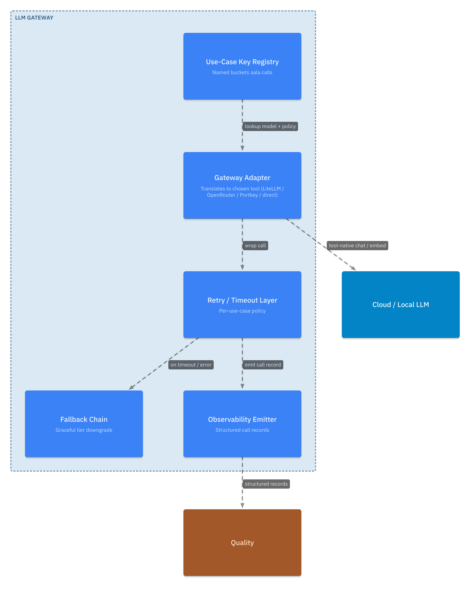
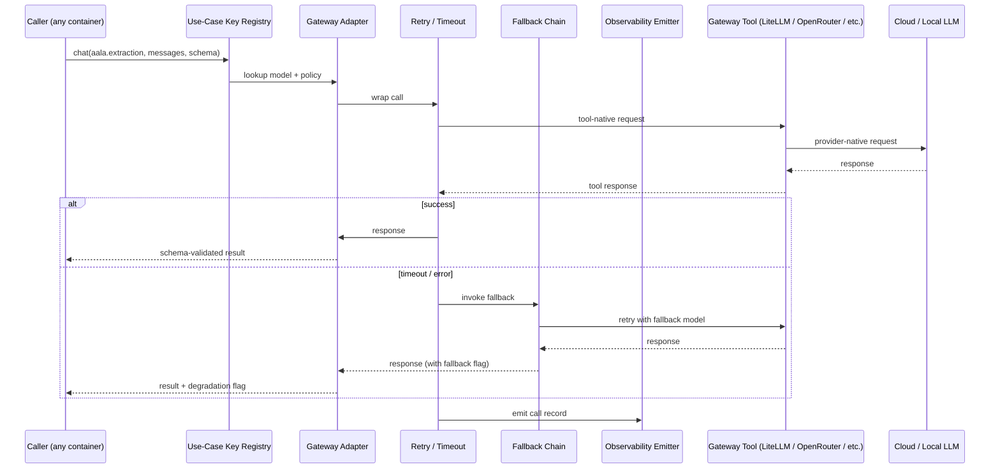

# L3 — LLM Gateway Components

For the container framing, see [`L2/09-llm-gateway.md`](../L2/09-llm-gateway.md). LLM Gateway is the cross-cutting infrastructure that every other container uses for language-model access. The implementer picks the underlying gateway tool; the deployer configures models for each use-case key.

## Component diagram

## Component reference

| Component | Responsibility | Internal state | Emits / consumes |
|---|---|---|---|
| **Use-Case Key Registry** | The named buckets aala calls (`aala.extraction`, `aala.conflict_judge`, `aala.projection_narrative`, `aala.label_synthesis`, `aala.blast_implicit`, `aala.synthesis`, `aala.faithfulness_judge`, `aala.relevance_filter`, `aala.embedding_default`). Published by aala; configured by the deployer in their gateway tool. | The registered key list with intent descriptions per key. | Read at startup by every container that issues calls. |
| **Gateway Adapter** | One concrete adapter for the gateway tool the implementer chose (LiteLLM / OpenRouter / Portkey / direct provider SDK / custom). Translates aala's call shape into the tool's native API and back. | Connection / auth context. | In: aala chat / embed call. Out: tool-native request. |
| **Retry / Timeout Layer** | Applies per-use-case timeouts and retry budgets. Uses the gateway tool's retry features when available. | Per-use-case policy config. | Wraps every outbound call. |
| **Fallback Chain** | For use cases where graceful degradation across tiers is configured ("extraction: top-tier; on persistent failure, fall back to mid-tier with confidence flag"). | Per-use-case fallback chain config. | Activated when primary call fails. |
| **Observability Emitter** | Emits structured call records per call: use_case_key, latency, tokens, error class, retry count. | None of its own. | Sent to [Quality](./10-quality.md) telemetry and operational tooling. |

## Internal flow — a call

## Variation points

| Variation | Owned by | Examples |
|---|---|---|
| Gateway tool | Implementer | LiteLLM, OpenRouter, Portkey, direct provider SDK, custom thin adapter. |
| Models per use case | Deployer | Configured in the gateway tool; deployer brings their own provider subscriptions / endpoints / local model servers. |
| Retry / fallback policy | Implementer (with sensible defaults; may expose deployer knobs) | "extraction: top-tier, on fail retry once at mid-tier with confidence flag." |
| Observability sink | Implementer (what) + deployer (where) | Stdout / structured logs / metrics endpoint / Quality telemetry stream. |
| Schema enforcement | Implementer | Strict (malformed → error); permissive (best-effort parse with warning); off (return raw text). |
| Streaming support | Implementer | Full streaming on all calls; opt-in via `chat_streaming`; disabled. |
