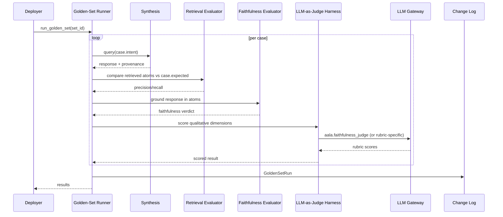

# L3 — Quality Components

For the container framing, see [`L2/10-quality.md`](../L2/10-quality.md). Quality measures the system's outputs across benchmarks, golden sets, faithfulness, planted contradictions, shadow eval, and telemetry. It is observation-only — it consumes other containers' read APIs and produces signal.

## Component diagram

## Component reference

| Component | Responsibility | Internal state | Emits / consumes |
|---|---|---|---|
| **Benchmark Corpus** | Implementer-maintained synthetic test ground. Services, ADRs with rationale, planted contradictions, multi-hop questions. Versioned with aala releases. | The corpus itself. | Read by Benchmark Runner. |
| **Benchmark Runner** | Runs the corpus on every release. Gates deploys on regressions. Typically invoked by CI. | Last-run results, history. | Reads Benchmark Corpus. Calls Retrieval / Faithfulness Evaluators and LLM-as-Judge. Triggers `BenchmarkRun` events. |
| **Golden-Set Runner** | Deployer-facing eval surface. Executes deployer-authored golden sets against [Synthesis](./08-synthesis.md) or directly against retrieval. | Golden-set definitions, last-run results per set. | Triggers `GoldenSetRun` events. |
| **Retrieval Evaluator** | Precision / recall over retrieved atoms vs. expected atoms. Deterministic — does not depend on prose. | None. | Reads from [Atoms](./03-atoms.md) (expected vs. actual). Used by Benchmark and Golden-Set Runners. |
| **Faithfulness Evaluator** | Checks that every claim in a generated response appears in the retrieved atom set (or is trivially derivable). Catches confabulation. | None. | Used by Benchmark and Golden-Set Runners. Same component is invoked by [Synthesis](./08-synthesis.md) at runtime when its faithfulness mode is active. |
| **LLM-as-Judge Harness** | Rubric-based qualitative scoring (clarity, completeness, audience fit). | Rubric definitions. | Calls LLM Gateway with a configured judge tier (typically top-tier). |
| **Planted-Contradiction Runner** | Injects known contradictions into the system; verifies Conflict (inside Atoms) detects them. End-to-end check on the conflict pipeline. | Known-contradiction set. | Reads from Atoms; verifies expected classifications. |
| **Shadow Eval Orchestrator** | When the implementer ships a new version, mirrors a sample of real traffic to the new version alongside production. Logs diffs for sample review. | Sample-rate config; diff buffer. | Triggers `ShadowEvalDiff` events. |
| **Telemetry Aggregator** | Aggregate-only signals across containers (latency distributions, classification distributions, error rates). Privacy-respecting — no raw content leaves the deployment. | Aggregated counters and histograms. | In: structured call records (via Observability Emitter from [LLM Gateway](./09-llm-gateway.md) and Change Logs across containers). Out: dashboards / external metrics. |
| **Failed-Query Archive** | Per-deployment store of queries with negative feedback + full provenance. Deployer-reviewed. | Archive entries with feedback + provenance. | Triggers `FeedbackRecorded` events. |
| **Change Log** | Maintains the ordered, append-only event log. | Event sequence. | Emits `BenchmarkRun` / `GoldenSetRun` / `FeedbackRecorded` / `ShadowEvalDiff`. Serves `changes_since(ref)`. |

## Internal flow — a golden-set run

## Variation points

| Variation | Owned by | Examples |
|---|---|---|
| Benchmark scope | Implementer | None (skip); basic smoke tests; full (planted contradictions + multi-hop + audience-fit). |
| Golden-set authoring surface | Implementer | Config files; CLI; web UI in deployer console. |
| Telemetry granularity | Implementer | Counters only; structured per-call records; full prompt+response logging (with consent + redaction). |
| Shadow eval | Implementer | Off; sample-rate-based; deterministic on specific call signatures. |
| Judge tier | Implementer / deployer | Cheap tier (fast, less reliable); top-tier (accurate, expensive); ensemble. Selected via `aala.faithfulness_judge` use-case key. |
| Eval-result persistence | Implementer | In the snapshot alongside atoms; in Quality's own store; both. |
