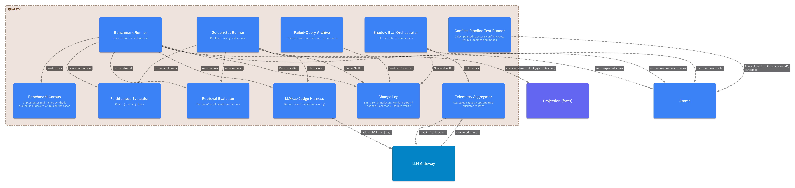
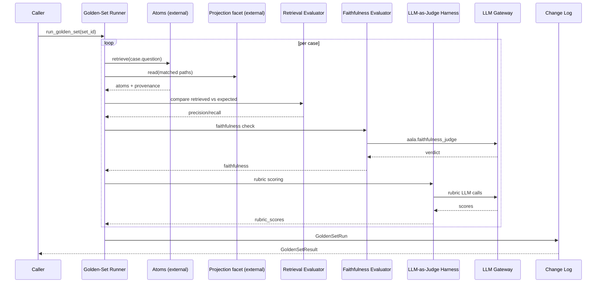
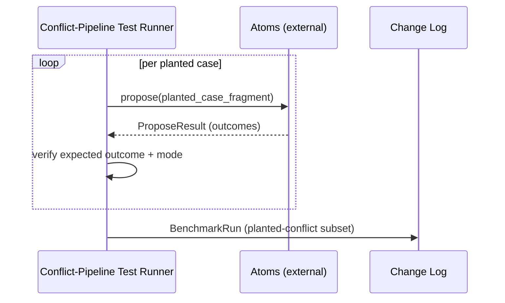

# L3 — Quality Components

For the container framing, see [`L2/10-quality.md`](../L2/10-quality.md). Quality is the one container that knows whether the other containers are doing a good job — and accumulates evidence over time.

## Component diagram

## Component reference

| Component | Responsibility | Internal state | Emits / consumes |
|---|---|---|---|
| **Benchmark Corpus** | Implementer-maintained synthetic test ground. Cross-tree scenarios, planted structural conflict cases (composition single-parent violations, generalization cycles, disjointness ↔ equivalence contradictions), multi-hop questions. Versioned with aala releases. | The corpus itself. | Read by Benchmark Runner. |
| **Benchmark Runner** | Executes the corpus on each release. Gates deploys on regressions. | Last benchmark results. | Reads corpus + every container's read API; calls LLM Gateway for LLM-as-judge dimensions. Emits `BenchmarkRun`. |
| **Golden-Set Runner** | Deployer-facing eval surface. Executes a named `{question, expected_sections, expected_answer_traits}` set as retrieval + faithfulness eval over aala's read surfaces (structured [Atoms](./03-atoms.md) reads + the [Projection](./04-projection.md) facet) and scores the result. | Per-set last-run results. | Reads golden set; reads Atoms + Projection facet; scores via Retrieval + Faithfulness + LLM-as-Judge evaluators. Emits `GoldenSetRun`. |
| **Retrieval Evaluator** | Precision and recall over retrieved atoms vs. expected atoms. Deterministic; doesn't depend on prose. | None. | Pure comparison. |
| **Faithfulness Evaluator** | Checks that every claim asserted in a candidate response appears in the retrieved atom set (or is trivially derivable). Catches confabulation. | None. | Calls LLM Gateway with `aala.faithfulness_judge`. |
| **LLM-as-Judge Harness** | Rubric-based scoring of qualitative dimensions (clarity, completeness, audience fit) via an LLM call. Configurable per dimension. | Rubric definitions. | Calls LLM Gateway. |
| **Conflict-Pipeline Test Runner** | Injects known structural conflict cases (per [`docs/spec/06-conflict-classification.md`](../spec/06-conflict-classification.md)) and verifies the Conflict pipeline detects them at the right mode (auto-resolve / soft-prompt / hard-block). End-to-end check on the conflict layer. | None. | Drives `Atoms.propose` with planted cases; verifies outcomes. |
| **Shadow Eval Orchestrator** | When the implementer ships a new version, runs the new version alongside production on a sample of real traffic. Logs diffs for sample review. | Shadow eval config + diff log. | Mirrors calls; emits `ShadowEvalDiff`. |
| **Telemetry Aggregator** | Emits structured aggregates from per-call records (LLM Gateway, Atoms outcomes, container change streams). Supports dimensions: container, use case, snapshot, tree. Privacy-respecting — no raw content. | Aggregated metrics. | Consumes per-call records; produces `MetricsResult`. |
| **Failed-Query Archive** | Per-deployment store of queries with negative feedback (thumbs-down, structured complaints) + their full provenance (atoms, derived atoms, navigation paths, generated response). Surface for deployer review. | Archive entries. | Receives `record_feedback` calls. Emits `FeedbackRecorded`. |
| **Change Log** | Maintains the ordered, append-only event log for the container. | Event sequence + ref / checkpoint surface. | Emits all the runner and feedback events. |

## Internal flow — golden set run

## Internal flow — conflict-pipeline test

## Variation points

| Variation | Owned by | Examples |
|---|---|---|
| Benchmark scope | Implementer | None (skip); basic (smoke tests); full (planted structural conflicts + multi-hop questions + audience-fit cases). |
| Golden-set authoring surface | Implementer | Config files; CLI; web UI in deployer console. |
| Telemetry granularity | Implementer | Counters only; structured per-call records; full prompt+response logging (with consent + redaction). |
| Tree-bucketed metrics | Implementer | Off (aggregate only); on (compare extraction quality across `planning` vs `implementation`). |
| Shadow eval | Implementer | Off; sample-rate-based; deterministic on specific call signatures. |
| Judge tier | Implementer / deployer | Cheap-tier judge (fast, less reliable); top-tier judge; ensemble. |
| Eval-result persistence | Implementer | In-snapshot; in Quality's own store; both. |
| Conflict-pipeline test coverage | Implementer | Smoke (one case per outcome kind); full (broad coverage of every outcome with positive and negative variants). |
